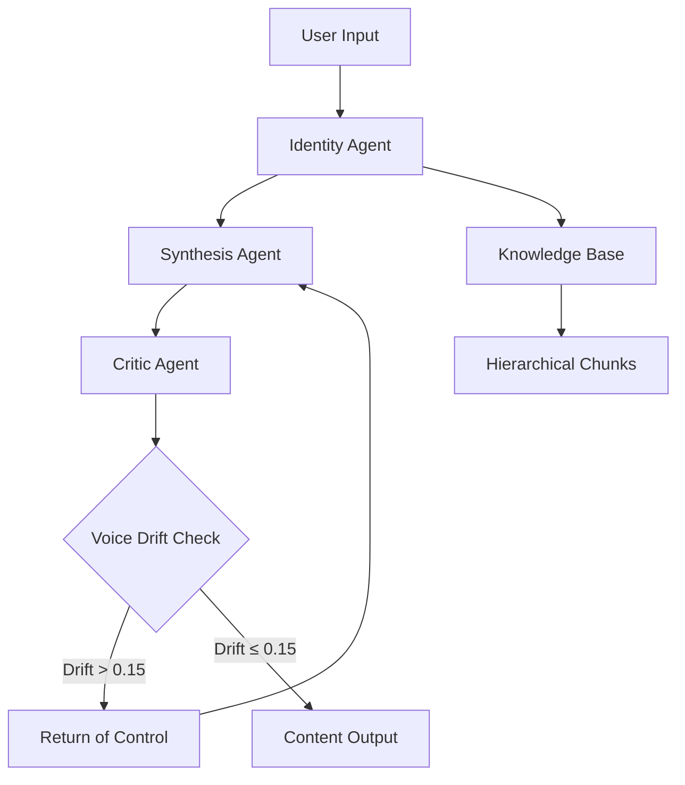

# Technical Design: PersonaVerse AI Agentic Architecture

**Project**: PersonaVerse AI - AWS 2026 Multi-Agent Digital Identity System  
**Version**: 1.0  
**Date**: January 2025  
**Architecture**: Bedrock Agents with Return of Control (RoC) Pattern

---

## Executive Summary

PersonaVerse AI implements a sophisticated multi-agent orchestration system using AWS 2026 standards to solve the fundamental challenge of **Identity Vectorization** at scale. The architecture leverages Claude 4.5 for synthesis, Amazon Nova for multimodal analysis, and a novel Return of Control pattern for voice drift correction. This design ensures authentic digital identity preservation while enabling cultural transcreation for Bharat's diverse creator ecosystem.

---

## 1. Multi-Agent Orchestration Architecture

### 1.1 Agent Topology & Responsibilities



#### Identity Agent (Memory Retrieval & Context Assembly)
- **Primary Model**: Amazon Nova Multimodal for identity vector computation
- **Function**: Retrieves relevant persona memories from Bedrock Knowledge Base using hierarchical chunking
- **Context Window Management**: Implements sliding window approach (8K tokens) with relevance scoring
- **Output**: Structured context payload with persona DNA, historical patterns, and cultural markers

#### Synthesis Agent (Content Generation)
- **Primary Model**: Claude 4.5 via Cross-Region Inference Profiles
- **Function**: Generates content by merging past memory + current intent + selected persona layer
- **Temperature Mapping**: Dynamic adjustment based on emotion sliders (urgency: 0.3-0.9, enthusiasm: 0.7-0.95)
- **Platform Adaptation**: Applies formatting rules and length constraints per target platform

#### Critic Agent (Quality Assurance & Voice Drift Detection)
- **Primary Model**: Claude 4.5 with specialized validation prompts
- **Function**: Validates output against localization rules, canonical values, and voice drift thresholds
- **Drift Calculation**: Cosine similarity between current and historical identity vectors
- **RoC Trigger**: Initiates regeneration when drift exceeds 0.15 epsilon threshold

### 1.2 Return of Control (RoC) Pattern Implementation

```typescript
interface RoCDecision {
  shouldRegenerate: boolean;
  driftScore: number;
  violationType: 'voice_drift' | 'cultural_misalignment' | 'generic_language';
  correctivePrompt: string;
  maxRetries: number;
}

class CriticAgent {
  async evaluateContent(content: string, persona: PersonaLayer): Promise<RoCDecision> {
    const driftScore = await this.calculateVoiceDrift(content, persona);
    const culturalAlignment = await this.assessCulturalResonance(content);
    const genericLanguageDetected = this.detectGenericPatterns(content);
    
    if (driftScore > 0.15 || culturalAlignment < 0.7 || genericLanguageDetected) {
      return {
        shouldRegenerate: true,
        driftScore,
        violationType: this.classifyViolation(driftScore, culturalAlignment, genericLanguageDetected),
        correctivePrompt: this.generateCorrectivePrompt(persona, content),
        maxRetries: 3
      };
    }
    
    return { shouldRegenerate: false, driftScore, violationType: null, correctivePrompt: '', maxRetries: 0 };
  }
}
```

---

## 2. Hierarchical Knowledge Base Architecture

### 2.1 Context Window Fragmentation Solution

**Challenge**: Claude 4.5's 200K context window becomes fragmented when processing multiple persona layers and historical data.

**Solution**: Hierarchical Chunking with Relevance Scoring

```text
Level 1: Core Identity Vectors (Permanent Storage)
├── Linguistic DNA fingerprints
├── Canonical values and beliefs  
├── Visual style preferences
└── Cultural alignment markers

Level 2: Persona Layer Configurations (Versioned)
├── Founder: Technical vocabulary, high authority, cricket metaphors
├── Educator: Conversational style, high empathy, learning metaphors
└── Casual: Street vocabulary, high authenticity, daily life metaphors

Level 3: Temporal Snapshots (Monthly Retention)
├── Voice evolution tracking
├── Platform adaptation patterns
└── Audience feedback integration

Level 4: Generation History (90-day Retention)
├── Recent content samples
├── Successful transcreation examples
└── Voice drift incident logs
```

### 2.2 OpenSearch Serverless Implementation

```typescript
interface HierarchicalChunk {
  chunkId: string;
  level: 1 | 2 | 3 | 4;
  personaId: string;
  relevanceScore: number;
  embedding: number[];
  metadata: {
    timestamp: string;
    contentType: 'identity' | 'persona_config' | 'temporal_snapshot' | 'generation_history';
    culturalMarkers: string[];
    platformContext?: string;
  };
}

class KnowledgeBaseManager {
  async retrieveRelevantChunks(query: string, personaId: string, maxTokens: number = 8000): Promise<HierarchicalChunk[]> {
    const queryEmbedding = await this.generateEmbedding(query);
    
    // Prioritize Level 1 (core identity) and Level 2 (persona config)
    const coreChunks = await this.searchByLevel([1, 2], queryEmbedding, personaId);
    const contextualChunks = await this.searchByLevel([3, 4], queryEmbedding, personaId);
    
    return this.optimizeTokenUsage([...coreChunks, ...contextualChunks], maxTokens);
  }
}
```

---

## 3. Identity Vectorization Engine

### 3.1 Multimodal Analysis Pipeline

```typescript
interface IdentityVector {
  linguisticDNA: {
    cadencePattern: number[];      // Rhythm analysis from audio
    syntaxComplexity: number;      // Sentence structure scoring
    vocabularyDistribution: Map<string, number>; // Word frequency analysis
    hinglishRatio: number;         // Code-switching frequency
  };
  
  culturalMarkers: {
    metaphorPreferences: string[]; // Cricket vs. business vs. family
    regionalSlang: string[];       // Tier-2/3 specific expressions
    formalitySpectrum: number;     // 1-10 scale across contexts
  };
  
  emotionalBaseline: {
    optimismBias: number;          // Sentiment tendency
    authorityLevel: number;        // Confidence in assertions
    empathyIndicators: number;     // Concern for audience
    enthusiasmMarkers: number;     // Energy and passion levels
  };
  
  visualStyle?: {
    colorPalette: string[];        // Preferred aesthetic colors
    compositionStyle: string;      // Urban/traditional/modern
    culturalSymbols: string[];     // Visual identity markers
  };
}

class IdentityExtractionEngine {
  async extractFromMultimodal(content: string, mediaType: 'text' | 'audio' | 'image' | 'video'): Promise<IdentityVector> {
    const novaEmbeddings = await this.generateNovaEmbeddings(content, mediaType);
    const linguisticAnalysis = await this.analyzeLinguisticPatterns(content);
    const culturalMarkers = await this.extractCulturalMarkers(content);
    const emotionalProfile = await this.computeEmotionalBaseline(content);
    
    let visualStyle: IdentityVector['visualStyle'] = undefined;
    if (mediaType === 'image' || mediaType === 'video') {
      visualStyle = await this.analyzeVisualStyle(content);
    }
    
    return {
      linguisticDNA: linguisticAnalysis,
      culturalMarkers,
      emotionalBaseline: emotionalProfile,
      visualStyle
    };
  }
}
```

### 3.2 Visual Identity Sync (Amazon Rekognition Integration)

```typescript
class VisualIdentityAnalyzer {
  async analyzeProfileImage(imageUrl: string): Promise<VisualStyleProfile> {
    const rekognitionResults = await this.rekognition.detectLabels({
      Image: { S3Object: { Bucket: this.bucket, Name: imageUrl } },
      MaxLabels: 50,
      MinConfidence: 80
    }).promise();
    
    const culturalMarkers = this.extractCulturalVisualMarkers(rekognitionResults);
    const colorAnalysis = await this.analyzeColorPalette(imageUrl);
    const compositionStyle = this.classifyCompositionStyle(rekognitionResults);
    
    return {
      aestheticType: this.determineAestheticType(culturalMarkers, compositionStyle),
      colorPalette: colorAnalysis.dominantColors,
      styleKeywords: this.generateStyleKeywords(culturalMarkers, compositionStyle),
      culturalResonance: this.calculateCulturalResonance(culturalMarkers)
    };
  }
  
  private extractCulturalVisualMarkers(labels: AWS.Rekognition.Label[]): string[] {
    const culturalIndicators = [
      'Traditional Clothing', 'Modern Architecture', 'Street Food',
      'Festival Decorations', 'Urban Landscape', 'Rural Setting',
      'Technology Devices', 'Cultural Symbols', 'Regional Art'
    ];
    
    return labels
      .filter(label => culturalIndicators.some(indicator => 
        label.Name?.toLowerCase().includes(indicator.toLowerCase())
      ))
      .map(label => label.Name!)
      .filter(Boolean);
  }
}
```

---

## 4. Bharat Localization Engine

### 4.1 The "Sixer Rule" Implementation

```typescript
interface LocalizationRule {
  id: string;
  sourcePattern: RegExp;
  targetReplacement: string;
  culturalContext: string;
  confidence: number;
  examples: TranscreationExample[];
}

class BharatLocalizationEngine {
  private localizationRules: LocalizationRule[] = [
    {
      id: 'sports_metaphors',
      sourcePattern: /\b(home run|touchdown|slam dunk)\b/gi,
      targetReplacement: 'sixer',
      culturalContext: 'Cricket is the dominant sport metaphor in Indian culture',
      confidence: 0.95,
      examples: [
        { 
          original: "That was a real home run!", 
          transcreated: "That was a perfect sixer!" 
        }
      ]
    },
    {
      id: 'business_metaphors',
      sourcePattern: /\b(low-hanging fruit|circle back|touch base)\b/gi,
      targetReplacement: 'easy target',
      culturalContext: 'Direct, action-oriented language resonates better',
      confidence: 0.88,
      examples: [
        { 
          original: "Let's grab the low-hanging fruit first", 
          transcreated: "Let's tackle the easy targets first" 
        }
      ]
    }
  ];
  
  async applyTranscreation(content: string, persona: PersonaLayer): Promise<TranscreationResult> {
    let transcreatedContent = content;
    const appliedRules: string[] = [];
    
    for (const rule of this.localizationRules) {
      if (rule.sourcePattern.test(transcreatedContent)) {
        transcreatedContent = transcreatedContent.replace(
          rule.sourcePattern, 
          this.contextualizeReplacement(rule.targetReplacement, persona)
        );
        appliedRules.push(rule.id);
      }
    }
    
    return {
      originalContent: content,
      transcreatedContent,
      appliedRules,
      culturalResonanceScore: await this.calculateCulturalResonance(transcreatedContent, persona)
    };
  }
}
```

### 4.2 Dynamic Hinglish Integration

```typescript
class HinglishIntegrationEngine {
  async integrateHinglish(content: string, targetRatio: number, persona: PersonaLayer): Promise<string> {
    const sentences = this.segmentSentences(content);
    const currentRatio = this.calculateHinglishRatio(content);
    
    if (Math.abs(currentRatio - targetRatio) <= 0.05) {
      return content; // Within acceptable tolerance
    }
    
    const adjustmentNeeded = targetRatio - currentRatio;
    
    if (adjustmentNeeded > 0) {
      return this.increaseHinglishUsage(sentences, adjustmentNeeded, persona);
    } else {
      return this.decreaseHinglishUsage(sentences, Math.abs(adjustmentNeeded), persona);
    }
  }
  
  private increaseHinglishUsage(sentences: string[], adjustment: number, persona: PersonaLayer): string {
    const hinglishSubstitutions = this.getPersonaSpecificSubstitutions(persona);
    let modifiedSentences = [...sentences];
    
    // Apply substitutions based on emotional context and sentence position
    for (let i = 0; i < modifiedSentences.length && adjustment > 0; i++) {
      const sentence = modifiedSentences[i];
      const emotionalIntensity = this.assessEmotionalIntensity(sentence);
      
      if (emotionalIntensity > 0.6) { // High emotion increases Hinglish likelihood
        modifiedSentences[i] = this.applyHinglishSubstitution(sentence, hinglishSubstitutions);
        adjustment -= 0.1; // Approximate adjustment per substitution
      }
    }
    
    return modifiedSentences.join(' ');
  }
}
```

---

## 5. Audience Mirror AI Architecture

### 5.1 Demographic Simulation Engine

```typescript
interface DemographicProfile {
  id: string;
  name: string;
  location: string;
  tier: 1 | 2 | 3;
  characteristics: {
    languagePreference: 'english' | 'hinglish' | 'regional';
    culturalContext: string[];
    professionalBackground: string;
    contentConsumptionPatterns: string[];
  };
  reactionPatterns: {
    positiveIndicators: string[];
    negativeIndicators: string[];
    neutralIndicators: string[];
  };
}

class AudienceMirrorEngine {
  private demographics: DemographicProfile[] = [
    {
      id: 'tier2_student_indore',
      name: 'Tier-2 Student (Indore)',
      location: 'Indore, Madhya Pradesh',
      tier: 2,
      characteristics: {
        languagePreference: 'hinglish',
        culturalContext: ['family-oriented', 'value-conscious', 'aspiration-driven'],
        professionalBackground: 'Engineering/Commerce Student',
        contentConsumptionPatterns: ['relatable examples', 'practical advice', 'motivational content']
      },
      reactionPatterns: {
        positiveIndicators: ['feels authentic', 'like a big brother', 'practical advice'],
        negativeIndicators: ['too corporate', 'disconnected', 'overly formal'],
        neutralIndicators: ['informative', 'standard content', 'okay']
      }
    },
    {
      id: 'tier1_vc_bangalore',
      name: 'Tier-1 VC (Bangalore)',
      location: 'Bangalore, Karnataka',
      tier: 1,
      characteristics: {
        languagePreference: 'english',
        culturalContext: ['innovation-focused', 'global-minded', 'efficiency-driven'],
        professionalBackground: 'Venture Capital/Investment',
        contentConsumptionPatterns: ['strategic insights', 'market analysis', 'scalability focus']
      },
      reactionPatterns: {
        positiveIndicators: ['strategic thinking', 'market insight', 'scalable approach'],
        negativeIndicators: ['too casual', 'lacks depth', 'unprofessional'],
        neutralIndicators: ['standard business content', 'expected perspective']
      }
    }
  ];
  
  async simulateReactions(content: string, platform: string): Promise<AudienceReaction[]> {
    const reactions: AudienceReaction[] = [];
    
    for (const demographic of this.demographics) {
      const reaction = await this.generateDemographicReaction(content, demographic, platform);
      reactions.push(reaction);
    }
    
    return reactions;
  }
  
  private async generateDemographicReaction(
    content: string, 
    demographic: DemographicProfile, 
    platform: string
  ): Promise<AudienceReaction> {
    const culturalAlignment = this.assessCulturalAlignment(content, demographic);
    const languageAppropriatenesss = this.assessLanguageAppropriateness(content, demographic);
    const contentRelevance = this.assessContentRelevance(content, demographic);
    
    const overallSentiment = this.calculateOverallSentiment(
      culturalAlignment, 
      languageAppropriatenesss, 
      contentRelevance
    );
    
    return {
      demographic: demographic.name,
      reaction: this.generateReactionText(overallSentiment, demographic),
      sentiment: overallSentiment > 0.6 ? 'positive' : overallSentiment < 0.4 ? 'negative' : 'neutral',
      confidence: this.calculateConfidence(culturalAlignment, languageAppropriatenesss, contentRelevance),
      culturalResonance: culturalAlignment
    };
  }
}
```

---

## 6. Performance & Scalability Architecture

### 6.1 Lambda Auto-Scaling Configuration

```typescript
// CDK Infrastructure Configuration
const personaEngineFunction = new lambda.Function(this, 'PersonaEngineFunction', {
  runtime: lambda.Runtime.NODEJS_20_X,
  handler: 'persona-engine.handler',
  code: lambda.Code.fromAsset('dist/persona-engine'),
  memorySize: 3008, // Maximum memory for optimal performance
  timeout: cdk.Duration.seconds(29), // Just under API Gateway limit
  reservedConcurrentExecutions: 100, // Prevent runaway scaling
  environment: {
    BEDROCK_REGION: 'us-east-1',
    KNOWLEDGE_BASE_ID: knowledgeBase.knowledgeBaseId,
    PERSONA_TABLE_NAME: personaTable.tableName,
    VOICE_DRIFT_THRESHOLD: '0.15'
  }
});

// Auto-scaling based on request volume
personaEngineFunction.addEventSource(new SqsEventSource(requestQueue, {
  batchSize: 10,
  maxBatchingWindow: cdk.Duration.seconds(5),
  reportBatchItemFailures: true
}));
```

### 6.2 DynamoDB Performance Optimization

```typescript
// Persona State Table with optimized GSI
const personaTable = new dynamodb.Table(this, 'PersonaStateTable', {
  tableName: 'PersonaVerse-PersonaState',
  partitionKey: { name: 'userId', type: dynamodb.AttributeType.STRING },
  sortKey: { name: 'personaId', type: dynamodb.AttributeType.STRING },
  billingMode: dynamodb.BillingMode.PAY_PER_REQUEST,
  pointInTimeRecovery: true,
  stream: dynamodb.StreamViewType.NEW_AND_OLD_IMAGES // For real-time updates
});

// GSI for efficient persona type queries
personaTable.addGlobalSecondaryIndex({
  indexName: 'PersonaTypeIndex',
  partitionKey: { name: 'personaType', type: dynamodb.AttributeType.STRING },
  sortKey: { name: 'lastUsed', type: dynamodb.AttributeType.STRING },
  projectionType: dynamodb.ProjectionType.ALL
});

// GSI for voice drift monitoring
personaTable.addGlobalSecondaryIndex({
  indexName: 'VoiceDriftIndex',
  partitionKey: { name: 'userId', type: dynamodb.AttributeType.STRING },
  sortKey: { name: 'driftScore', type: dynamodb.AttributeType.NUMBER },
  projectionType: dynamodb.ProjectionType.INCLUDE,
  nonKeyAttributes: ['personaId', 'lastDriftCheck', 'driftHistory']
});
```

---

## 7. Observability & Monitoring

### 7.1 CloudWatch Metrics & Alarms

```typescript
// Custom metrics for persona alignment tracking
const personaAlignmentMetric = new cloudwatch.Metric({
  namespace: 'PersonaVerse/Quality',
  metricName: 'PersonaAlignmentScore',
  dimensionsMap: {
    PersonaType: 'All',
    Platform: 'All'
  },
  statistic: 'Average'
});

// Voice drift monitoring
const voiceDriftAlarm = new cloudwatch.Alarm(this, 'VoiceDriftAlarm', {
  metric: new cloudwatch.Metric({
    namespace: 'PersonaVerse/Quality',
    metricName: 'VoiceDriftScore',
    statistic: 'Maximum'
  }),
  threshold: 0.15,
  evaluationPeriods: 2,
  treatMissingData: cloudwatch.TreatMissingData.NOT_BREACHING
});

// Cultural resonance tracking
const culturalResonanceMetric = new cloudwatch.Metric({
  namespace: 'PersonaVerse/Impact',
  metricName: 'CulturalResonanceScore',
  dimensionsMap: {
    Demographic: 'All',
    Region: 'All'
  },
  statistic: 'Average'
});
```

### 7.2 X-Ray Distributed Tracing

```typescript
// Enable X-Ray tracing for multi-agent orchestration
import * as AWSXRay from 'aws-xray-sdk-core';

class PersonaOrchestrator {
  async processRequest(request: GenerationRequest): Promise<GenerationResponse> {
    const segment = AWSXRay.getSegment();
    
    // Identity Agent subsegment
    const identitySubsegment = segment?.addNewSubsegment('IdentityAgent');
    const identityContext = await this.identityAgent.retrieveContext(request);
    identitySubsegment?.close();
    
    // Synthesis Agent subsegment
    const synthesisSubsegment = segment?.addNewSubsegment('SynthesisAgent');
    const generatedContent = await this.synthesisAgent.generateContent(identityContext, request);
    synthesisSubsegment?.close();
    
    // Critic Agent subsegment
    const criticSubsegment = segment?.addNewSubsegment('CriticAgent');
    const validation = await this.criticAgent.validateContent(generatedContent, request.personaId);
    criticSubsegment?.close();
    
    // Return of Control if needed
    if (validation.shouldRegenerate) {
      const rocSubsegment = segment?.addNewSubsegment('ReturnOfControl');
      const correctedContent = await this.synthesisAgent.regenerateWithCorrection(
        identityContext, 
        request, 
        validation.correctivePrompt
      );
      rocSubsegment?.close();
      return correctedContent;
    }
    
    return generatedContent;
  }
}
```

---

## 8. Security & Compliance

### 8.1 Bedrock Guardrails Configuration

```typescript
const guardrailsConfig = {
  guardrailIdentifier: 'personaverse-guardrails',
  guardrailVersion: 'DRAFT',
  contentPolicyConfig: {
    filtersConfig: [
      {
        type: 'SEXUAL',
        inputStrength: 'HIGH',
        outputStrength: 'HIGH'
      },
      {
        type: 'VIOLENCE',
        inputStrength: 'HIGH',
        outputStrength: 'HIGH'
      },
      {
        type: 'HATE',
        inputStrength: 'HIGH',
        outputStrength: 'HIGH'
      },
      {
        type: 'INSULTS',
        inputStrength: 'MEDIUM',
        outputStrength: 'MEDIUM'
      }
    ]
  },
  topicPolicyConfig: {
    topicsConfig: [
      {
        name: 'Political Content',
        definition: 'Content related to political parties, elections, or political figures',
        examples: ['election campaigns', 'political endorsements'],
        type: 'DENY'
      }
    ]
  },
  wordPolicyConfig: {
    wordsConfig: [
      {
        text: 'inappropriate-word-list'
      }
    ],
    managedWordListsConfig: [
      {
        type: 'PROFANITY'
      }
    ]
  },
  sensitiveInformationPolicyConfig: {
    piiEntitiesConfig: [
      {
        type: 'EMAIL',
        action: 'BLOCK'
      },
      {
        type: 'PHONE',
        action: 'ANONYMIZE'
      }
    ]
  }
};
```

---

## Conclusion

This technical design establishes PersonaVerse AI as a **Strategic Digital Identity Utility** through:

1. **Multi-Agent Orchestration**: Sophisticated agent coordination with Return of Control patterns
2. **Hierarchical Knowledge Architecture**: Solving context window fragmentation with intelligent chunking
3. **Identity Vectorization**: Deep multimodal analysis preserving authentic voice characteristics
4. **Cultural Transcreation**: The "Sixer Rule" and dynamic Hinglish integration
5. **Predictive Audience Intelligence**: Multi-demographic simulation for cultural resonance
6. **Temporal Consistency**: Voice drift detection maintaining longitudinal identity persistence

The architecture demonstrates technical excellence while addressing the fundamental challenge of authentic voice preservation in AI-generated content, positioning PersonaVerse as essential infrastructure for India's digital creator economy.
