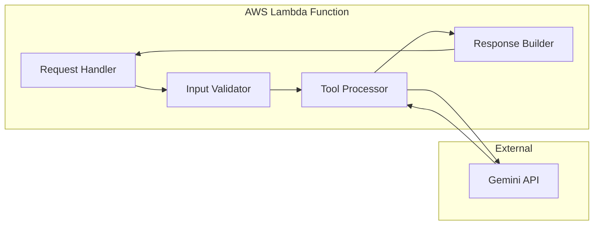

# Design Document: Workflow Intelligence Tools

## Overview

The Workflow Intelligence Tools module extends PersonaVerse AI with three independent content workflow utilities designed for Bharat creators. This module operates as a completely isolated, non-destructive addition that provides content simplification, calendar planning, and gap analysis capabilities without modifying any existing persona-driven generation logic.

### Design Philosophy

This design follows strict isolation principles to ensure zero impact on existing PersonaVerse functionality:

- **Non-Destructive Architecture**: All new code resides in `/backend/workflow_tools/` directory
- **Independent API Surface**: New routes use `/tools/` prefix, separate from existing `/api/` routes
- **Separate Frontend Tab**: New "Workflow Tools" navigation tab isolated from existing persona features
- **No Shared State**: Tools operate independently without accessing persona engine state
- **Gemini API Integration**: Uses Google's Gemini API (not AWS Bedrock) to maintain separation

### Key Features

1. **Content Simplifier**: Transforms complex content into multiple accessibility formats (5th grade, bullets, WhatsApp, voice script, Hinglish)
2. **Calendar Generator**: Produces strategic weekly content plans with cultural awareness (Indian festivals, IST timezone, regional context)
3. **Gap Analyzer**: Identifies content patterns and opportunities from existing post collections

### Bharat-First Cultural Integration

All three tools incorporate Bharat-specific intelligence:
- Hinglish code-switching with natural 60-80% English / 20-40% Hindi ratios
- Indian cultural metaphor replacement (e.g., "home run" → "sixer")
- IST timezone awareness for optimal posting times
- Indian festival and regional event integration
- WhatsApp communication pattern familiarity
- Tier-2 city slang and regional references

## Architecture

### System Context

```mermaid
graph TB
    subgraph "Frontend (React 19)"
        WT[Workflow Tools Tab]
        CS[Content Simplifier UI]
        CG[Calendar Generator UI]
        GA[Gap Analyzer UI]
    end
    
    subgraph "Backend - Workflow Tools Module"
        API[/tools/* Routes]
        SVC[Tool Services]
        MOCK[Mock Provider]
        GEMINI[Gemini API Client]
    end
    
    subgraph "External Services"
        GAPI[Google Gemini API]
    end
    
    subgraph "Existing PersonaVerse (Untouched)"
        PE[Persona Engine]
        AE[Adaptive Engine]
        BEDROCK[AWS Bedrock]
    end
    
    WT --> CS
    WT --> CG
    WT --> GA
    
    CS --> API
    CG --> API
    GA --> API
    
    API --> SVC
    SVC --> MOCK
    SVC --> GEMINI
    GEMINI --> GAPI
    
    style PE fill:#e0e0e0
    style AE fill:#e0e0e0
    style BEDROCK fill:#e0e0e0
```


### Deployment Architecture

The module follows stateless Lambda-compatible design:



Key architectural constraints:
- **Stateless**: No session state between requests
- **No Filesystem Persistence**: All processing in-memory
- **Timeout Aware**: 30-45 second processing limits
- **Context from Request**: All necessary data in request payload

### Directory Structure

```
backend/
├── workflow_tools/              # NEW - Isolated module
│   ├── index.ts                 # Main entry point & route definitions
│   ├── types.ts                 # TypeScript interfaces for all tools
│   ├── services/
│   │   ├── simplifier.service.ts
│   │   ├── calendar.service.ts
│   │   └── gap-analyzer.service.ts
│   ├── providers/
│   │   ├── gemini.client.ts     # Gemini API integration
│   │   └── mock.provider.ts     # Development mocks
│   ├── validators/
│   │   └── input.validator.ts   # Request validation logic
│   ├── exporters/
│   │   ├── json.exporter.ts
│   │   ├── txt.exporter.ts
│   │   └── pdf.exporter.ts
│   └── __tests__/
│       ├── simplifier.test.ts
│       ├── calendar.test.ts
│       └── gap-analyzer.test.ts
├── services/                    # EXISTING - Untouched
│   └── persona-engine/
├── engines/                     # EXISTING - Untouched
│   ├── audienceEngine.ts
│   ├── domainEngine.ts
│   └── engagementEngine.ts
└── api/                         # EXISTING - Untouched
    └── routesAdapter.ts

frontend/
├── src/
│   ├── features/
│   │   ├── workflow-tools/      # NEW - Isolated feature
│   │   │   ├── WorkflowToolsTab.tsx
│   │   │   ├── ContentSimplifier.tsx
│   │   │   ├── CalendarGenerator.tsx
│   │   │   ├── GapAnalyzer.tsx
│   │   │   └── ExportButtons.tsx
│   │   ├── persona-dna/         # EXISTING - Untouched
│   │   └── adaptive-intelligence/ # EXISTING - Untouched
│   └── services/
│       ├── workflowTools.service.ts # NEW
│       ├── personaService.ts    # EXISTING - Untouched
│       └── adaptiveService.ts   # EXISTING - Untouched
```

## Components and Interfaces

### Backend Components

#### 1. Tool Services Layer

Each tool is implemented as an independent service with a consistent interface:

**SimplifierService**
- Accepts text input or file upload
- Calls Gemini API with structured prompt
- Returns 5 formatted outputs (grade5, bullets, whatsapp, voice, hinglish)
- Validates cultural adaptation quality

**CalendarService**
- Accepts niche, audience, frequency parameters
- Generates 7-day content plan
- Identifies upcoming Indian festivals (next 30 days)
- Returns structured weekly plan with IST timing

**GapAnalyzerService**
- Accepts array of 3-50 posts
- Analyzes patterns using Gemini API
- Calculates diversity score (0-100)
- Returns overused themes, missing topics, fatigue risk


#### 2. Gemini API Client

**GeminiClient** provides unified interface to Google's Gemini API:

```typescript
class GeminiClient {
  constructor(apiKey: string);
  
  async generateContent(prompt: string, config: GenerationConfig): Promise<string>;
  async generateStructured<T>(prompt: string, schema: JSONSchema): Promise<T>;
  
  // Handles authentication, retries, error mapping
}
```

Key responsibilities:
- API key authentication via GEMINI_API_KEY environment variable
- Request/response formatting
- Error handling and retry logic
- Timeout management (30-45 seconds)
- Rate limit detection

#### 3. Mock Provider

**MockProvider** simulates Gemini API responses for development:

```typescript
class MockProvider {
  getSimplifierResponse(input: string): SimplifierOutput;
  getCalendarResponse(niche: string): CalendarOutput;
  getGapAnalysisResponse(posts: string[]): GapAnalysisOutput;
}
```

Mock responses include:
- Realistic Bharat-specific content examples
- Proper Hinglish code-switching
- Indian cultural references
- Exact schema matching real API responses

#### 4. Input Validators

**InputValidator** ensures request data meets requirements:

```typescript
class InputValidator {
  validateSimplifierInput(data: any): ValidationResult;
  validateCalendarInput(data: any): ValidationResult;
  validateGapAnalyzerInput(data: any): ValidationResult;
}
```

Validation rules:
- Character limits (50-10,000 for text)
- File size limits (2-5MB)
- Array length constraints (3-50 posts)
- Required field presence
- Format validation (file types)

#### 5. Export System

**Exporters** generate downloadable files in multiple formats:

```typescript
interface Exporter {
  export(data: ToolOutput, metadata: ExportMetadata): Buffer;
}

class JSONExporter implements Exporter { }
class TXTExporter implements Exporter { }
class PDFExporter implements Exporter { }
```

Export features:
- Descriptive filenames with timestamps
- Proper formatting for readability
- Metadata inclusion (tool name, generation time)
- 10-second generation timeout

### Frontend Components

#### 1. WorkflowToolsTab Component

Main container for the workflow tools feature:

```typescript
interface WorkflowToolsTabProps {
  userId: string;
}

const WorkflowToolsTab: React.FC<WorkflowToolsTabProps> = ({ userId }) => {
  // Manages tool selection state
  // Displays tool cards
  // Handles navigation between tools
}
```

#### 2. ContentSimplifier Component

```typescript
interface ContentSimplifierProps {
  onExport: (data: SimplifierOutput, format: ExportFormat) => void;
}

const ContentSimplifier: React.FC<ContentSimplifierProps> = ({ onExport }) => {
  // Text input or file upload
  // Optional audience context field
  // Submit button with loading state
  // Results display with 5 output sections
  // Export buttons (JSON, TXT, PDF)
}
```

#### 3. CalendarGenerator Component

```typescript
interface CalendarGeneratorProps {
  onExport: (data: CalendarOutput, format: ExportFormat) => void;
}

const CalendarGenerator: React.FC<CalendarGeneratorProps> = ({ onExport }) => {
  // Niche/topic input field
  // Target audience description
  // Frequency selector (daily, 3x/week, weekly)
  // Generate button with loading state
  // Weekly plan display (7-day grid)
  // Platform strategy cards
  // Export buttons
}
```

#### 4. GapAnalyzer Component

```typescript
interface GapAnalyzerProps {
  onExport: (data: GapAnalysisOutput, format: ExportFormat) => void;
}

const GapAnalyzer: React.FC<GapAnalyzerProps> = ({ onExport }) => {
  // Dynamic post entry list (add/remove)
  // File upload for multiple posts
  // Optional niche context field
  // Analyze button with loading state
  // Visual risk indicators (color-coded)
  // Diversity score gauge
  // Overused themes with percentages
  // Missing topics suggestions
  // Re-analyze button
  // Export buttons
}
```


## Data Models

### TypeScript Interfaces

#### Request Types

```typescript
// Content Simplifier Request
export interface SimplifierRequest {
  input: string;                    // Text content (50-10,000 chars)
  audienceContext?: string;         // Optional context (max 500 chars)
  inputType: 'text' | 'file';
  fileName?: string;                // If inputType is 'file'
}

// Calendar Generator Request
export interface CalendarRequest {
  niche: string;                    // Required (max 200 chars)
  targetAudience: string;           // Required (max 500 chars)
  frequency?: 'daily' | '3x-week' | 'weekly'; // Optional
}

// Gap Analyzer Request
export interface GapAnalyzerRequest {
  posts: string[];                  // Array of 3-50 posts
  nicheContext?: string;            // Optional (max 200 chars)
}
```

#### Response Types

```typescript
// Content Simplifier Output
export interface SimplifierOutput {
  grade5_explanation: string;       // 5th grade reading level
  bullet_summary: string[];         // 3-7 key points
  whatsapp_version: string;         // Conversational with emojis
  voice_script: string;             // Audio narration format
  regional_version: string;         // Hinglish (60-80% EN, 20-40% HI)
}

// Calendar Generator Output
export interface CalendarOutput {
  weekly_plan: DayPlan[];           // Exactly 7 days
  post_types: string[];             // 3-5 content formats
  hooks: string[];                  // 5-10 attention grabbers
  platform_strategy: PlatformStrategy;
  best_times: PostingTime[];        // IST timezone
  upcoming_festivals?: FestivalSuggestion[];
}

export interface DayPlan {
  day_name: string;                 // e.g., "Monday"
  post_idea: string;
  content_type: string;             // e.g., "Educational", "Behind-the-scenes"
  hook: string;
}

export interface PlatformStrategy {
  instagram: string;                // Platform-specific recommendations
  linkedin: string;
  youtube: string;
}

export interface PostingTime {
  time: string;                     // IST format (e.g., "9:00 AM IST")
  reason: string;                   // Why this time is optimal
}

export interface FestivalSuggestion {
  festival_name: string;
  date: string;                     // ISO 8601 format
  content_angle: string;
}

// Gap Analyzer Output
export interface GapAnalysisOutput {
  overused_themes: ThemeFrequency[];
  missing_topics: string[];         // 5-10 suggestions
  fatigue_risk: FatigueRisk;
  suggested_angles: string[];       // 5-10 opportunities
  diversity_score: number;          // 0-100
}

export interface ThemeFrequency {
  theme: string;
  frequency_percentage: number;     // e.g., 35 (appears in 35% of posts)
  example_posts: number[];          // Indices of posts with this theme
}

export interface FatigueRisk {
  level: 'low' | 'medium' | 'high';
  explanation: string;
  recommendation: string;
}
```

#### Standard API Response Wrapper

```typescript
// Success Response
export interface ToolSuccessResponse<T> {
  success: true;
  data: T;
  metadata: {
    timestamp: string;              // ISO 8601
    processing_duration_ms: number;
    tool_name: string;
    mock_mode: boolean;
  };
}

// Error Response
export interface ToolErrorResponse {
  success: false;
  error_code: string;
  message: string;
  details?: any;
  metadata: {
    timestamp: string;
    tool_name: string;
  };
}

export type ToolResponse<T> = ToolSuccessResponse<T> | ToolErrorResponse;
```

#### Error Codes

```typescript
export enum ToolErrorCode {
  // Input Validation Errors (400)
  INVALID_INPUT = 'INVALID_INPUT',
  INPUT_TOO_SHORT = 'INPUT_TOO_SHORT',
  INPUT_TOO_LONG = 'INPUT_TOO_LONG',
  FILE_TOO_LARGE = 'FILE_TOO_LARGE',
  UNSUPPORTED_FILE_TYPE = 'UNSUPPORTED_FILE_TYPE',
  INSUFFICIENT_POSTS = 'INSUFFICIENT_POSTS',
  TOO_MANY_POSTS = 'TOO_MANY_POSTS',
  MISSING_REQUIRED_FIELD = 'MISSING_REQUIRED_FIELD',
  
  // Authentication Errors (401)
  MISSING_API_KEY = 'MISSING_API_KEY',
  INVALID_API_KEY = 'INVALID_API_KEY',
  
  // Rate Limiting (429)
  RATE_LIMIT_EXCEEDED = 'RATE_LIMIT_EXCEEDED',
  
  // Processing Errors (500)
  GEMINI_API_ERROR = 'GEMINI_API_ERROR',
  PROCESSING_TIMEOUT = 'PROCESSING_TIMEOUT',
  EXPORT_GENERATION_FAILED = 'EXPORT_GENERATION_FAILED',
  INTERNAL_ERROR = 'INTERNAL_ERROR',
}
```


### API Endpoint Specifications

#### POST /tools/simplify

Simplifies complex content into multiple accessibility formats.

**Request Body:**
```json
{
  "input": "string (50-10,000 chars)",
  "audienceContext": "string (optional, max 500 chars)",
  "inputType": "text | file",
  "fileName": "string (optional)"
}
```

**Success Response (200):**
```json
{
  "success": true,
  "data": {
    "grade5_explanation": "string",
    "bullet_summary": ["string", "string", "string"],
    "whatsapp_version": "string",
    "voice_script": "string",
    "regional_version": "string"
  },
  "metadata": {
    "timestamp": "2024-01-15T10:30:00.000Z",
    "processing_duration_ms": 2500,
    "tool_name": "content_simplifier",
    "mock_mode": false
  }
}
```

**Error Responses:**
- 400: Invalid input (INPUT_TOO_SHORT, INPUT_TOO_LONG, INVALID_INPUT)
- 401: Missing or invalid API key (MISSING_API_KEY)
- 429: Rate limit exceeded (RATE_LIMIT_EXCEEDED)
- 504: Processing timeout (PROCESSING_TIMEOUT)
- 500: Internal error (GEMINI_API_ERROR, INTERNAL_ERROR)

#### POST /tools/calendar

Generates strategic weekly content plan with cultural awareness.

**Request Body:**
```json
{
  "niche": "string (required, max 200 chars)",
  "targetAudience": "string (required, max 500 chars)",
  "frequency": "daily | 3x-week | weekly (optional)"
}
```

**Success Response (200):**
```json
{
  "success": true,
  "data": {
    "weekly_plan": [
      {
        "day_name": "Monday",
        "post_idea": "string",
        "content_type": "string",
        "hook": "string"
      }
    ],
    "post_types": ["string", "string", "string"],
    "hooks": ["string", "string", "string"],
    "platform_strategy": {
      "instagram": "string",
      "linkedin": "string",
      "youtube": "string"
    },
    "best_times": [
      {
        "time": "9:00 AM IST",
        "reason": "string"
      }
    ],
    "upcoming_festivals": [
      {
        "festival_name": "Holi",
        "date": "2024-03-25",
        "content_angle": "string"
      }
    ]
  },
  "metadata": {
    "timestamp": "2024-01-15T10:30:00.000Z",
    "processing_duration_ms": 3200,
    "tool_name": "calendar_generator",
    "mock_mode": false
  }
}
```

**Error Responses:** Same as /tools/simplify

#### POST /tools/gap-analysis

Analyzes content patterns and identifies opportunities.

**Request Body:**
```json
{
  "posts": ["string", "string", "string"],
  "nicheContext": "string (optional, max 200 chars)"
}
```

**Success Response (200):**
```json
{
  "success": true,
  "data": {
    "overused_themes": [
      {
        "theme": "string",
        "frequency_percentage": 35,
        "example_posts": [0, 3, 7]
      }
    ],
    "missing_topics": ["string", "string"],
    "fatigue_risk": {
      "level": "medium",
      "explanation": "string",
      "recommendation": "string"
    },
    "suggested_angles": ["string", "string"],
    "diversity_score": 65
  },
  "metadata": {
    "timestamp": "2024-01-15T10:30:00.000Z",
    "processing_duration_ms": 4100,
    "tool_name": "gap_analyzer",
    "mock_mode": false
  }
}
```

**Error Responses:**
- 400: Invalid input (INSUFFICIENT_POSTS, TOO_MANY_POSTS)
- Others same as /tools/simplify

#### GET /tools/export/:format

Downloads tool results in specified format.

**URL Parameters:**
- format: `json | txt | pdf`

**Query Parameters:**
- toolName: `simplifier | calendar | gap-analyzer`
- data: Base64-encoded JSON of tool output

**Success Response (200):**
- Content-Type: application/json | text/plain | application/pdf
- Content-Disposition: attachment; filename="tool-name-timestamp.format"
- Body: File content

**Error Responses:**
- 400: Invalid format or missing data
- 500: Export generation failed
- 504: Export timeout

### Gemini API Integration Patterns

#### Prompt Engineering for Bharat Context

All Gemini API prompts follow this structure:

```typescript
const buildPrompt = (tool: ToolType, input: any): string => {
  return `
You are a content assistant for Bharat (Indian) creators. Your responses must be:
- Culturally authentic to India (use Indian examples, festivals, references)
- Hinglish-aware (natural code-switching, not translation)
- Tier-2 city friendly (accessible language, regional context)
- WhatsApp communication style familiar

${getToolSpecificInstructions(tool)}

Input: ${JSON.stringify(input)}

Respond with ONLY valid JSON matching this schema:
${getToolSchema(tool)}
`;
};
```

#### Cultural Adaptation Rules

Embedded in every prompt:

1. **Metaphor Mapping:**
   - "Home run" → "Sixer"
   - "Touchdown" → "Century"
   - "Slam dunk" → "Perfect shot"

2. **Festival Awareness:**
   - Check calendar for: Diwali, Holi, Eid, Dussehra, Pongal, Onam, Ganesh Chaturthi
   - Regional festivals: Durga Puja (Bengal), Bihu (Assam), Lohri (Punjab)

3. **Hinglish Patterns:**
   - Natural mixing: "Yaar, this strategy is working great!"
   - Avoid literal translation: NOT "Aap kaise hain" → USE "How are you yaar"
   - 60-80% English, 20-40% Hindi words
   - Common Hindi words: yaar, bas, achha, theek hai, kya baat hai

4. **IST Timezone:**
   - All times in IST format
   - Peak engagement: 9-10 AM, 1-2 PM, 8-10 PM IST
   - Consider work hours, lunch breaks, evening leisure


#### Authentication and Configuration

```typescript
// Environment Configuration
interface ToolsConfig {
  gemini: {
    apiKey: string;              // GEMINI_API_KEY env var
    model: string;               // e.g., "gemini-pro"
    timeout: number;             // 30000ms for simplifier/calendar, 45000ms for gap analyzer
    maxRetries: number;          // 2
  };
  mock: {
    enabled: boolean;            // MOCK_MODE env var
  };
  limits: {
    simplifierMaxChars: 10000;
    calendarMaxNicheChars: 200;
    gapAnalyzerMinPosts: 3;
    gapAnalyzerMaxPosts: 50;
    fileMaxSizeMB: 5;
  };
}
```

#### Error Handling Strategy

```typescript
class GeminiClient {
  async generateStructured<T>(prompt: string, schema: JSONSchema): Promise<T> {
    try {
      const response = await this.callGeminiAPI(prompt);
      const parsed = JSON.parse(response);
      
      // Validate against schema
      if (!this.validateSchema(parsed, schema)) {
        throw new ToolError(ToolErrorCode.GEMINI_API_ERROR, 
          'Response does not match expected schema');
      }
      
      return parsed as T;
      
    } catch (error) {
      if (error.code === 'ECONNREFUSED') {
        throw new ToolError(ToolErrorCode.GEMINI_API_ERROR, 
          'Cannot connect to Gemini API');
      }
      
      if (error.status === 401) {
        throw new ToolError(ToolErrorCode.INVALID_API_KEY, 
          'Gemini API key is invalid');
      }
      
      if (error.status === 429) {
        throw new ToolError(ToolErrorCode.RATE_LIMIT_EXCEEDED, 
          'Gemini API rate limit exceeded. Please try again later.');
      }
      
      if (error.name === 'TimeoutError') {
        throw new ToolError(ToolErrorCode.PROCESSING_TIMEOUT, 
          'Processing took too long. Please try with shorter input.');
      }
      
      throw new ToolError(ToolErrorCode.INTERNAL_ERROR, 
        'An unexpected error occurred');
    }
  }
}
```

### Mock System Design

#### Mock Provider Implementation

```typescript
class MockProvider {
  // Returns realistic Bharat-specific mock data
  getSimplifierResponse(input: string): SimplifierOutput {
    return {
      grade5_explanation: "This is a simple explanation that a 5th grader can understand. " +
        "We use easy words and short sentences. Like explaining cricket to a friend!",
      
      bullet_summary: [
        "Main point explained simply",
        "Second important thing to remember",
        "Third key takeaway for you"
      ],
      
      whatsapp_version: "Arre yaar! 😊 Let me explain this simply. " +
        "Basically, the main idea is this... Makes sense na? 👍",
      
      voice_script: "Hello friends. Today I want to share something interesting with you. " +
        "Listen carefully. [Pause] The main point is... [Pause] Let me explain with an example...",
      
      regional_version: "Dekho yaar, main concept yeh hai ki... " +
        "It's actually quite simple once you understand the basics. " +
        "Samjhe? Let me break it down for you..."
    };
  }
  
  getCalendarResponse(niche: string): CalendarOutput {
    return {
      weekly_plan: [
        {
          day_name: "Monday",
          post_idea: "Share a motivational story from your journey",
          content_type: "Personal Story",
          hook: "3 years ago, I was exactly where you are today..."
        },
        {
          day_name: "Tuesday",
          post_idea: "Educational tip related to your niche",
          content_type: "Educational",
          hook: "Here's something nobody tells you about..."
        },
        // ... 5 more days
      ],
      
      post_types: [
        "Personal Stories",
        "Educational Tips",
        "Behind-the-Scenes",
        "Quick Wins",
        "Community Engagement"
      ],
      
      hooks: [
        "Yaar, this changed everything for me...",
        "Nobody talks about this, but...",
        "Here's the truth about...",
        "3 years ago vs today...",
        "Stop doing this immediately..."
      ],
      
      platform_strategy: {
        instagram: "Focus on visual storytelling with carousel posts. Use Reels for quick tips.",
        linkedin: "Share professional insights and case studies. Engage in comments.",
        youtube: "Create in-depth tutorials and weekly vlogs. Build community through consistency."
      },
      
      best_times: [
        { time: "9:00 AM IST", reason: "Morning commute time, high engagement" },
        { time: "1:00 PM IST", reason: "Lunch break scrolling" },
        { time: "8:30 PM IST", reason: "Evening leisure time, peak activity" }
      ],
      
      upcoming_festivals: [
        {
          festival_name: "Holi",
          date: "2024-03-25",
          content_angle: "Share colorful transformation stories or before/after content"
        }
      ]
    };
  }
  
  getGapAnalysisResponse(posts: string[]): GapAnalysisOutput {
    return {
      overused_themes: [
        {
          theme: "Motivational quotes",
          frequency_percentage: 40,
          example_posts: [0, 2, 5, 8]
        },
        {
          theme: "Personal achievements",
          frequency_percentage: 30,
          example_posts: [1, 4, 7]
        }
      ],
      
      missing_topics: [
        "Behind-the-scenes process content",
        "Failure stories and lessons learned",
        "Community engagement posts",
        "Educational how-to guides",
        "Industry trends and analysis"
      ],
      
      fatigue_risk: {
        level: "medium",
        explanation: "You're posting similar motivational content frequently. " +
          "Audience may start scrolling past without engaging.",
        recommendation: "Diversify with educational content, behind-the-scenes, and community questions."
      },
      
      suggested_angles: [
        "Share a recent failure and what you learned",
        "Do a Q&A post asking audience questions",
        "Create a step-by-step tutorial",
        "Share industry news with your take",
        "Post a day-in-the-life story"
      ],
      
      diversity_score: 55
    };
  }
}
```

#### Mock Mode Activation

```typescript
// In service layer
class SimplifierService {
  constructor(
    private geminiClient: GeminiClient,
    private mockProvider: MockProvider,
    private config: ToolsConfig
  ) {}
  
  async simplify(request: SimplifierRequest): Promise<SimplifierOutput> {
    // Check if mock mode is enabled
    if (this.config.mock.enabled) {
      console.log('[MOCK MODE] Returning mock simplifier response');
      await this.simulateDelay(1000); // Simulate API latency
      return this.mockProvider.getSimplifierResponse(request.input);
    }
    
    // Real Gemini API call
    const prompt = this.buildSimplifierPrompt(request);
    return await this.geminiClient.generateStructured<SimplifierOutput>(
      prompt,
      SimplifierOutputSchema
    );
  }
  
  private async simulateDelay(ms: number): Promise<void> {
    return new Promise(resolve => setTimeout(resolve, ms));
  }
}
```


## Error Handling

### Error Classification

Errors are classified into five categories with appropriate HTTP status codes:

#### 1. Input Validation Errors (400 Bad Request)

Triggered when user input doesn't meet requirements:

```typescript
class InputValidator {
  validateSimplifierInput(data: any): ValidationResult {
    if (!data.input) {
      return {
        valid: false,
        error: {
          code: ToolErrorCode.MISSING_REQUIRED_FIELD,
          message: 'Input text is required',
          details: { field: 'input' }
        }
      };
    }
    
    if (data.input.length < 50) {
      return {
        valid: false,
        error: {
          code: ToolErrorCode.INPUT_TOO_SHORT,
          message: 'Input must be at least 50 characters',
          details: { current: data.input.length, minimum: 50 }
        }
      };
    }
    
    if (data.input.length > 10000) {
      return {
        valid: false,
        error: {
          code: ToolErrorCode.INPUT_TOO_LONG,
          message: 'Input must not exceed 10,000 characters',
          details: { current: data.input.length, maximum: 10000 }
        }
      };
    }
    
    return { valid: true };
  }
}
```

#### 2. Authentication Errors (401 Unauthorized)

Triggered when API key is missing or invalid:

```typescript
if (!process.env.GEMINI_API_KEY) {
  throw new ToolError(
    ToolErrorCode.MISSING_API_KEY,
    'Gemini API key not configured. Please set GEMINI_API_KEY environment variable.',
    { configGuide: 'https://ai.google.dev/gemini-api/docs/api-key' }
  );
}
```

#### 3. Rate Limiting Errors (429 Too Many Requests)

Triggered when Gemini API rate limits are exceeded:

```typescript
if (error.status === 429) {
  const retryAfter = error.headers['retry-after'] || 60;
  throw new ToolError(
    ToolErrorCode.RATE_LIMIT_EXCEEDED,
    `Rate limit exceeded. Please try again in ${retryAfter} seconds.`,
    { retryAfter, endpoint: 'Gemini API' }
  );
}
```

#### 4. Timeout Errors (504 Gateway Timeout)

Triggered when processing exceeds time limits:

```typescript
const timeoutMs = tool === 'gap-analyzer' ? 45000 : 30000;

const timeoutPromise = new Promise((_, reject) => {
  setTimeout(() => {
    reject(new ToolError(
      ToolErrorCode.PROCESSING_TIMEOUT,
      `Processing exceeded ${timeoutMs / 1000} second limit. Try with shorter input.`,
      { timeoutMs, tool }
    ));
  }, timeoutMs);
});

const result = await Promise.race([
  processRequest(request),
  timeoutPromise
]);
```

#### 5. Internal Errors (500 Internal Server Error)

Triggered for unexpected errors:

```typescript
catch (error) {
  // Log full error for debugging
  console.error('[INTERNAL ERROR]', error);
  
  // Return sanitized error to client
  throw new ToolError(
    ToolErrorCode.INTERNAL_ERROR,
    'An unexpected error occurred. Please try again.',
    { requestId: generateRequestId() }
  );
}
```

### Error Response Format

All errors follow consistent JSON structure:

```typescript
interface ErrorResponse {
  success: false;
  error_code: string;
  message: string;           // User-friendly message
  details?: any;             // Additional context (optional)
  metadata: {
    timestamp: string;
    tool_name: string;
    request_id?: string;     // For tracking
  };
}
```

Example error responses:

```json
// Input validation error
{
  "success": false,
  "error_code": "INPUT_TOO_SHORT",
  "message": "Input must be at least 50 characters",
  "details": {
    "current": 25,
    "minimum": 50
  },
  "metadata": {
    "timestamp": "2024-01-15T10:30:00.000Z",
    "tool_name": "content_simplifier"
  }
}

// API authentication error
{
  "success": false,
  "error_code": "MISSING_API_KEY",
  "message": "Gemini API key not configured. Please set GEMINI_API_KEY environment variable.",
  "details": {
    "configGuide": "https://ai.google.dev/gemini-api/docs/api-key"
  },
  "metadata": {
    "timestamp": "2024-01-15T10:30:00.000Z",
    "tool_name": "calendar_generator"
  }
}

// Rate limit error
{
  "success": false,
  "error_code": "RATE_LIMIT_EXCEEDED",
  "message": "Rate limit exceeded. Please try again in 60 seconds.",
  "details": {
    "retryAfter": 60,
    "endpoint": "Gemini API"
  },
  "metadata": {
    "timestamp": "2024-01-15T10:30:00.000Z",
    "tool_name": "gap_analyzer"
  }
}
```

### Frontend Error Handling

```typescript
// In workflowTools.service.ts
async simplifyContent(request: SimplifierRequest): Promise<SimplifierOutput> {
  try {
    const response = await fetch('/tools/simplify', {
      method: 'POST',
      headers: { 'Content-Type': 'application/json' },
      body: JSON.stringify(request)
    });
    
    const data = await response.json();
    
    if (!data.success) {
      // Map error codes to user-friendly messages
      const userMessage = this.getUserFriendlyMessage(data.error_code, data.message);
      throw new Error(userMessage);
    }
    
    return data.data;
    
  } catch (error) {
    // Network errors
    if (error.name === 'TypeError' && error.message.includes('fetch')) {
      throw new Error('Cannot connect to server. Please check your internet connection.');
    }
    
    throw error;
  }
}

private getUserFriendlyMessage(errorCode: string, defaultMessage: string): string {
  const messages: Record<string, string> = {
    'INPUT_TOO_SHORT': 'Please provide at least 50 characters of text to simplify.',
    'INPUT_TOO_LONG': 'Text is too long. Please limit to 10,000 characters.',
    'MISSING_API_KEY': 'System configuration error. Please contact support.',
    'RATE_LIMIT_EXCEEDED': 'Too many requests. Please wait a moment and try again.',
    'PROCESSING_TIMEOUT': 'Processing took too long. Try with shorter content.',
  };
  
  return messages[errorCode] || defaultMessage;
}
```

### Logging Strategy

```typescript
interface LogEntry {
  timestamp: string;
  level: 'info' | 'warn' | 'error';
  tool: string;
  event: string;
  duration_ms?: number;
  mock_mode: boolean;
  error?: {
    code: string;
    message: string;
  };
  metadata?: any;
}

class Logger {
  log(entry: LogEntry): void {
    const formatted = JSON.stringify({
      ...entry,
      timestamp: new Date().toISOString()
    });
    
    console.log(formatted);
    
    // In production, send to CloudWatch Logs
    if (process.env.NODE_ENV === 'production') {
      // CloudWatch integration
    }
  }
}

// Usage
logger.log({
  level: 'info',
  tool: 'content_simplifier',
  event: 'request_received',
  mock_mode: config.mock.enabled,
  metadata: { inputLength: request.input.length }
});

logger.log({
  level: 'info',
  tool: 'content_simplifier',
  event: 'request_completed',
  duration_ms: 2500,
  mock_mode: false
});

logger.log({
  level: 'error',
  tool: 'calendar_generator',
  event: 'gemini_api_error',
  error: {
    code: 'RATE_LIMIT_EXCEEDED',
    message: 'Rate limit exceeded'
  },
  mock_mode: false
});
```


## Testing Strategy

### Dual Testing Approach

The Workflow Intelligence Tools module requires both unit testing and property-based testing for comprehensive coverage:

**Unit Tests**: Verify specific examples, edge cases, and error conditions
**Property Tests**: Verify universal properties across all inputs

Both approaches are complementary and necessary. Unit tests catch concrete bugs in specific scenarios, while property tests verify general correctness across a wide range of inputs.

### Unit Testing

#### Test Framework

- **Framework**: Jest (TypeScript)
- **Coverage Target**: 80% code coverage minimum
- **Test Location**: `backend/workflow_tools/__tests__/`

#### Unit Test Categories

**1. Input Validation Tests**

Test specific validation rules:

```typescript
describe('SimplifierService - Input Validation', () => {
  it('should reject input shorter than 50 characters', () => {
    const input = 'Too short';
    expect(() => validator.validateSimplifierInput({ input }))
      .toThrow('INPUT_TOO_SHORT');
  });
  
  it('should reject input longer than 10,000 characters', () => {
    const input = 'a'.repeat(10001);
    expect(() => validator.validateSimplifierInput({ input }))
      .toThrow('INPUT_TOO_LONG');
  });
  
  it('should accept valid input between 50-10,000 characters', () => {
    const input = 'a'.repeat(500);
    const result = validator.validateSimplifierInput({ input });
    expect(result.valid).toBe(true);
  });
});
```

**2. Mock Mode Tests**

Verify mock responses match real API schema:

```typescript
describe('MockProvider', () => {
  it('should return valid SimplifierOutput schema', () => {
    const mock = new MockProvider();
    const output = mock.getSimplifierResponse('test input');
    
    expect(output).toHaveProperty('grade5_explanation');
    expect(output).toHaveProperty('bullet_summary');
    expect(output).toHaveProperty('whatsapp_version');
    expect(output).toHaveProperty('voice_script');
    expect(output).toHaveProperty('regional_version');
    expect(Array.isArray(output.bullet_summary)).toBe(true);
  });
  
  it('should include Hinglish in regional_version', () => {
    const mock = new MockProvider();
    const output = mock.getSimplifierResponse('test input');
    
    // Check for Hindi words mixed with English
    const hasHinglish = /\b(yaar|dekho|samjhe|bas|achha)\b/i.test(output.regional_version);
    expect(hasHinglish).toBe(true);
  });
});
```

**3. Error Handling Tests**

Test error scenarios:

```typescript
describe('GeminiClient - Error Handling', () => {
  it('should throw MISSING_API_KEY when API key is not set', async () => {
    delete process.env.GEMINI_API_KEY;
    const client = new GeminiClient();
    
    await expect(client.generateContent('test'))
      .rejects.toThrow('MISSING_API_KEY');
  });
  
  it('should throw PROCESSING_TIMEOUT after 30 seconds', async () => {
    const client = new GeminiClient();
    jest.spyOn(client, 'callGeminiAPI').mockImplementation(
      () => new Promise(resolve => setTimeout(resolve, 35000))
    );
    
    await expect(client.generateContent('test'))
      .rejects.toThrow('PROCESSING_TIMEOUT');
  }, 40000);
});
```

**4. Integration Tests**

Test end-to-end flows with mocks:

```typescript
describe('SimplifierService - Integration', () => {
  it('should successfully simplify content in mock mode', async () => {
    const config = { mock: { enabled: true } };
    const service = new SimplifierService(null, new MockProvider(), config);
    
    const result = await service.simplify({
      input: 'a'.repeat(100),
      inputType: 'text'
    });
    
    expect(result.grade5_explanation).toBeDefined();
    expect(result.bullet_summary.length).toBeGreaterThanOrEqual(3);
    expect(result.bullet_summary.length).toBeLessThanOrEqual(7);
  });
});
```

### Property-Based Testing

#### Test Framework

- **Library**: fast-check (TypeScript property-based testing)
- **Iterations**: Minimum 100 per property test
- **Test Location**: `backend/workflow_tools/__tests__/properties/`

#### Property Test Configuration

```typescript
import * as fc from 'fast-check';

// Custom arbitraries for Bharat-specific content
const hinglishText = fc.string({ minLength: 50, maxLength: 1000 })
  .map(s => s + ' yaar this is test content');

const postArray = fc.array(
  fc.string({ minLength: 20, maxLength: 500 }),
  { minLength: 3, maxLength: 50 }
);

const nicheString = fc.string({ minLength: 10, maxLength: 200 });
```

#### Property Test Tags

Each property test must reference its design document property:

```typescript
/**
 * Feature: workflow-intelligence-tools
 * Property 1: Content preservation through simplification
 */
```


## Correctness Properties

*A property is a characteristic or behavior that should hold true across all valid executions of a system—essentially, a formal statement about what the system should do. Properties serve as the bridge between human-readable specifications and machine-verifiable correctness guarantees.*

### Property Reflection

After analyzing all acceptance criteria, I identified the following redundancies and consolidations:

**Redundancy Analysis:**

1. **Input validation properties (2.1-2.5, 6.1-6.5, 10.1-10.5)**: These can be consolidated into a single comprehensive input validation property per tool rather than separate properties for each field.

2. **Output structure properties (3.1-3.6, 7.1-7.7, 11.1-11.6)**: These can be combined into single properties that validate complete output schemas rather than individual fields.

3. **API authentication (5.1, 9.1, 13.1)**: All three tools use the same authentication mechanism - one property covers all.

4. **Mock mode behavior (5.6, 9.5, 13.5, 17.1-17.2)**: Can be consolidated into a single property about mock/real mode schema consistency.

5. **Error response structure (18.6, 20.2)**: These describe the same invariant - all errors have consistent structure.

6. **Success response structure (20.1, 20.3, 20.4)**: These describe the same invariant - all successes have consistent structure.

7. **Timeout behavior (5.5, 9.4, 13.4, 14.7, 16.5)**: Can be consolidated into a single property about timeout handling across all tools.

**Consolidated Properties:**

After reflection, the following properties provide unique validation value without redundancy:


### Property 1: Input Validation Boundaries

*For any* tool (Simplifier, Calendar, Gap Analyzer) and any input data, when the input violates size constraints (character limits, array lengths, file sizes), the system should reject the input with an appropriate error code and not proceed with processing.

**Validates: Requirements 2.1, 2.2, 2.3, 2.4, 2.5, 6.1, 6.2, 6.3, 6.4, 6.5, 10.1, 10.2, 10.3, 10.4, 10.5**

### Property 2: Simplifier Output Schema Completeness

*For any* valid input text (50-10,000 characters), the Content Simplifier should return a response containing all five required fields: `grade5_explanation`, `bullet_summary` (array of 3-7 strings), `whatsapp_version`, `voice_script`, and `regional_version`.

**Validates: Requirements 3.1, 3.2, 3.3, 3.4, 3.5, 3.6**

### Property 3: Calendar Output Schema Completeness

*For any* valid niche and audience input, the Calendar Generator should return a response containing: `weekly_plan` (array of exactly 7 day objects, each with `day_name`, `post_idea`, `content_type`, `hook`), `post_types` (3-5 items), `hooks` (5-10 items), `platform_strategy` (with Instagram, LinkedIn, YouTube fields), and `best_times` array.

**Validates: Requirements 7.1, 7.2, 7.3, 7.4, 7.5, 7.6, 7.7**

### Property 4: Gap Analyzer Output Schema Completeness

*For any* valid array of posts (3-50 items), the Gap Analyzer should return a response containing: `overused_themes` (array with theme, frequency_percentage, example_posts), `missing_topics` (5-10 items), `fatigue_risk` (with level enum and explanation), `suggested_angles` (5-10 items), and `diversity_score` (number 0-100).

**Validates: Requirements 11.1, 11.2, 11.3, 11.4, 11.5, 11.6**

### Property 5: IST Timezone Consistency

*For any* Calendar Generator output, all time values in the `best_times` array should include "IST" timezone indicator in the time string.

**Validates: Requirements 7.6, 8.3**

### Property 6: Hinglish Content Presence

*For any* Simplifier output, the `regional_version` field should contain at least one Hindi word from the common set (yaar, dekho, samjhe, bas, achha, theek, kya, hai).

**Validates: Requirements 3.5, 4.3**

### Property 7: Mock Mode Schema Consistency

*For any* tool and any valid input, when Mock Mode is enabled, the response schema should be identical to the schema returned when Mock Mode is disabled (same fields, same types, same structure).

**Validates: Requirements 5.6, 9.5, 13.5, 17.1, 17.2**

### Property 8: Stateless Request Processing

*For any* two consecutive requests to the same tool with identical inputs, the responses should be independent (no shared state), and processing one request should not affect the processing of the next request.

**Validates: Requirements 16.1, 16.2**

### Property 9: Error Response Structure Invariant

*For all* error conditions (validation failures, authentication errors, rate limits, timeouts, internal errors), the response should have the structure: `success: false`, `error_code` (string), `message` (string), and `metadata` object with `timestamp` and `tool_name`.

**Validates: Requirements 18.1, 18.2, 18.3, 18.4, 18.5, 18.6, 20.2**

### Property 10: Success Response Structure Invariant

*For all* successful tool operations, the response should have the structure: `success: true`, `data` (object with tool-specific output), and `metadata` object containing `timestamp` (ISO 8601 format), `processing_duration_ms` (positive number), `tool_name`, and `mock_mode` (boolean).

**Validates: Requirements 20.1, 20.3, 20.4**

### Property 11: Response Schema Validation

*For all* tool outputs (Simplifier, Calendar, Gap Analyzer), before returning the response to the client, the system should validate that the response structure matches the expected schema for that tool, ensuring no malformed responses reach the client.

**Validates: Requirements 20.5**

### Property 12: Export Filename Format

*For any* tool output and any export format (JSON, TXT, PDF), the generated filename should follow the pattern: `{tool-name}-{timestamp}.{format}` where tool-name is one of (simplifier, calendar, gap-analyzer), timestamp is in ISO format, and format matches the requested type.

**Validates: Requirements 14.1, 14.2, 14.3, 14.4**

### Property 13: Timeout Enforcement

*For any* tool operation (Simplifier, Calendar, Gap Analyzer, Export), if processing exceeds the specified timeout limit (30s for Simplifier/Calendar, 45s for Gap Analyzer, 10s for Export), the system should terminate processing and return a timeout error with code PROCESSING_TIMEOUT.

**Validates: Requirements 5.5, 9.4, 13.4, 14.7, 16.5**

### Property 14: Error Message Descriptiveness

*For any* error response, the `message` field should be non-empty and contain human-readable text that describes the error condition (not just an error code).

**Validates: Requirements 5.4, 9.3, 13.3**

### Property 15: Emoji Presence in WhatsApp Version

*For any* Simplifier output, the `whatsapp_version` field should contain at least one emoji character (Unicode emoji range).

**Validates: Requirements 3.3**


### Property-Based Test Examples

#### Property 1: Input Validation Boundaries

```typescript
/**
 * Feature: workflow-intelligence-tools
 * Property 1: Input Validation Boundaries
 */
describe('Property 1: Input Validation Boundaries', () => {
  it('should reject inputs violating size constraints', () => {
    fc.assert(
      fc.property(
        fc.oneof(
          fc.string({ minLength: 0, maxLength: 49 }),      // Too short
          fc.string({ minLength: 10001, maxLength: 15000 }) // Too long
        ),
        async (invalidInput) => {
          const service = new SimplifierService(config);
          
          await expect(service.simplify({ input: invalidInput, inputType: 'text' }))
            .rejects.toThrow(/INPUT_TOO_SHORT|INPUT_TOO_LONG/);
        }
      ),
      { numRuns: 100 }
    );
  });
});
```

#### Property 2: Simplifier Output Schema Completeness

```typescript
/**
 * Feature: workflow-intelligence-tools
 * Property 2: Simplifier Output Schema Completeness
 */
describe('Property 2: Simplifier Output Schema Completeness', () => {
  it('should return all required fields for any valid input', () => {
    fc.assert(
      fc.property(
        fc.string({ minLength: 50, maxLength: 10000 }),
        async (validInput) => {
          const service = new SimplifierService(config);
          const result = await service.simplify({ input: validInput, inputType: 'text' });
          
          expect(result).toHaveProperty('grade5_explanation');
          expect(result).toHaveProperty('bullet_summary');
          expect(result).toHaveProperty('whatsapp_version');
          expect(result).toHaveProperty('voice_script');
          expect(result).toHaveProperty('regional_version');
          
          expect(Array.isArray(result.bullet_summary)).toBe(true);
          expect(result.bullet_summary.length).toBeGreaterThanOrEqual(3);
          expect(result.bullet_summary.length).toBeLessThanOrEqual(7);
        }
      ),
      { numRuns: 100 }
    );
  });
});
```

#### Property 7: Mock Mode Schema Consistency

```typescript
/**
 * Feature: workflow-intelligence-tools
 * Property 7: Mock Mode Schema Consistency
 */
describe('Property 7: Mock Mode Schema Consistency', () => {
  it('should return identical schema structure in mock and real mode', () => {
    fc.assert(
      fc.property(
        fc.string({ minLength: 50, maxLength: 1000 }),
        async (input) => {
          const mockConfig = { ...config, mock: { enabled: true } };
          const realConfig = { ...config, mock: { enabled: false } };
          
          const mockService = new SimplifierService(mockConfig);
          const realService = new SimplifierService(realConfig);
          
          const mockResult = await mockService.simplify({ input, inputType: 'text' });
          const realResult = await realService.simplify({ input, inputType: 'text' });
          
          // Check that both have the same keys
          expect(Object.keys(mockResult).sort()).toEqual(Object.keys(realResult).sort());
          
          // Check that array fields are arrays in both
          expect(Array.isArray(mockResult.bullet_summary)).toBe(Array.isArray(realResult.bullet_summary));
        }
      ),
      { numRuns: 100 }
    );
  });
});
```

#### Property 9: Error Response Structure Invariant

```typescript
/**
 * Feature: workflow-intelligence-tools
 * Property 9: Error Response Structure Invariant
 */
describe('Property 9: Error Response Structure Invariant', () => {
  it('should return consistent error structure for all error types', () => {
    fc.assert(
      fc.property(
        fc.oneof(
          fc.constant({ input: '' }),                    // Validation error
          fc.constant({ input: 'a'.repeat(50), apiKey: null }), // Auth error
          fc.constant({ input: 'a'.repeat(50), timeout: 0 })    // Timeout error
        ),
        async (errorScenario) => {
          try {
            const service = new SimplifierService(config);
            await service.simplify(errorScenario);
            fail('Should have thrown an error');
          } catch (error) {
            const errorResponse = error.toJSON();
            
            expect(errorResponse).toHaveProperty('success', false);
            expect(errorResponse).toHaveProperty('error_code');
            expect(errorResponse).toHaveProperty('message');
            expect(errorResponse).toHaveProperty('metadata');
            expect(errorResponse.metadata).toHaveProperty('timestamp');
            expect(errorResponse.metadata).toHaveProperty('tool_name');
            
            expect(typeof errorResponse.error_code).toBe('string');
            expect(typeof errorResponse.message).toBe('string');
            expect(errorResponse.message.length).toBeGreaterThan(0);
          }
        }
      ),
      { numRuns: 100 }
    );
  });
});
```

#### Property 10: Success Response Structure Invariant

```typescript
/**
 * Feature: workflow-intelligence-tools
 * Property 10: Success Response Structure Invariant
 */
describe('Property 10: Success Response Structure Invariant', () => {
  it('should return consistent success structure for all successful operations', () => {
    fc.assert(
      fc.property(
        fc.string({ minLength: 50, maxLength: 1000 }),
        async (input) => {
          const service = new SimplifierService(config);
          const response = await service.simplify({ input, inputType: 'text' });
          
          // Wrap in API response format
          const apiResponse = {
            success: true,
            data: response,
            metadata: {
              timestamp: new Date().toISOString(),
              processing_duration_ms: 1000,
              tool_name: 'content_simplifier',
              mock_mode: config.mock.enabled
            }
          };
          
          expect(apiResponse).toHaveProperty('success', true);
          expect(apiResponse).toHaveProperty('data');
          expect(apiResponse).toHaveProperty('metadata');
          expect(apiResponse.metadata).toHaveProperty('timestamp');
          expect(apiResponse.metadata).toHaveProperty('processing_duration_ms');
          expect(apiResponse.metadata).toHaveProperty('tool_name');
          expect(apiResponse.metadata).toHaveProperty('mock_mode');
          
          // Validate ISO 8601 timestamp format
          expect(() => new Date(apiResponse.metadata.timestamp)).not.toThrow();
          expect(typeof apiResponse.metadata.processing_duration_ms).toBe('number');
          expect(apiResponse.metadata.processing_duration_ms).toBeGreaterThan(0);
        }
      ),
      { numRuns: 100 }
    );
  });
});
```

### Test Coverage Goals

**Unit Test Coverage:**
- Input validation: 100% of validation rules
- Error handling: All error codes and scenarios
- Mock provider: All mock response formats
- Export system: All three formats (JSON, TXT, PDF)

**Property Test Coverage:**
- All 15 correctness properties implemented
- Minimum 100 iterations per property test
- Custom generators for Bharat-specific content

**Integration Test Coverage:**
- End-to-end flows for all three tools
- Mock mode vs real mode behavior
- API endpoint responses
- Export functionality

### Test Execution

```bash
# Run all tests
npm test

# Run unit tests only
npm run test:unit

# Run property tests only
npm run test:properties

# Run with coverage
npm run test:coverage

# Run in watch mode (development)
npm run test:watch
```

### Continuous Integration

Tests should run on every commit:
- All unit tests must pass
- All property tests must pass (100 iterations each)
- Code coverage must be ≥80%
- No TypeScript compilation errors
- No linting errors


## Implementation Considerations

### Gemini API Integration

#### API Client Configuration

```typescript
import { GoogleGenerativeAI } from '@google/generative-ai';

class GeminiClient {
  private genAI: GoogleGenerativeAI;
  private model: any;
  
  constructor(apiKey: string, modelName: string = 'gemini-pro') {
    if (!apiKey) {
      throw new ToolError(
        ToolErrorCode.MISSING_API_KEY,
        'GEMINI_API_KEY environment variable is required'
      );
    }
    
    this.genAI = new GoogleGenerativeAI(apiKey);
    this.model = this.genAI.getGenerativeModel({ model: modelName });
  }
  
  async generateStructured<T>(
    prompt: string,
    schema: JSONSchema,
    timeoutMs: number = 30000
  ): Promise<T> {
    const controller = new AbortController();
    const timeoutId = setTimeout(() => controller.abort(), timeoutMs);
    
    try {
      const result = await this.model.generateContent({
        contents: [{ role: 'user', parts: [{ text: prompt }] }],
        generationConfig: {
          temperature: 0.7,
          topK: 40,
          topP: 0.95,
          maxOutputTokens: 2048,
        },
      });
      
      clearTimeout(timeoutId);
      
      const response = await result.response;
      const text = response.text();
      
      // Parse and validate JSON
      const parsed = JSON.parse(text);
      
      if (!this.validateSchema(parsed, schema)) {
        throw new Error('Response does not match expected schema');
      }
      
      return parsed as T;
      
    } catch (error) {
      clearTimeout(timeoutId);
      
      if (error.name === 'AbortError') {
        throw new ToolError(
          ToolErrorCode.PROCESSING_TIMEOUT,
          `Processing exceeded ${timeoutMs / 1000} second limit`
        );
      }
      
      throw this.mapGeminiError(error);
    }
  }
  
  private mapGeminiError(error: any): ToolError {
    if (error.status === 401 || error.status === 403) {
      return new ToolError(
        ToolErrorCode.INVALID_API_KEY,
        'Gemini API authentication failed. Check your API key.'
      );
    }
    
    if (error.status === 429) {
      return new ToolError(
        ToolErrorCode.RATE_LIMIT_EXCEEDED,
        'Gemini API rate limit exceeded. Please try again later.'
      );
    }
    
    return new ToolError(
      ToolErrorCode.GEMINI_API_ERROR,
      `Gemini API error: ${error.message}`
    );
  }
  
  private validateSchema(data: any, schema: JSONSchema): boolean {
    // Simple schema validation
    // In production, use a library like ajv
    return true;
  }
}
```

#### Prompt Templates

```typescript
class PromptBuilder {
  static buildSimplifierPrompt(input: string, audienceContext?: string): string {
    return `
You are a content assistant for Bharat (Indian) creators. Transform the following content into multiple accessibility formats.

CULTURAL RULES:
- Replace Western metaphors with Indian equivalents (home run → sixer, touchdown → century)
- Use natural Hinglish (60-80% English, 20-40% Hindi words like yaar, dekho, samjhe)
- Include Indian examples and references
- For WhatsApp version: use communication patterns familiar to Indian users

INPUT CONTENT:
${input}

${audienceContext ? `TARGET AUDIENCE: ${audienceContext}` : ''}

Respond with ONLY valid JSON matching this exact structure:
{
  "grade5_explanation": "Simple explanation using 5th grade vocabulary",
  "bullet_summary": ["Point 1", "Point 2", "Point 3"],
  "whatsapp_version": "Conversational text with emojis 😊",
  "voice_script": "Script formatted for audio narration with pauses",
  "regional_version": "Hinglish version mixing English and Hindi naturally"
}

IMPORTANT: 
- bullet_summary must have 3-7 items
- whatsapp_version must include emojis
- regional_version must include Hindi words (yaar, dekho, etc.)
`;
  }
  
  static buildCalendarPrompt(niche: string, audience: string, frequency?: string): string {
    const today = new Date();
    const next30Days = new Date(today.getTime() + 30 * 24 * 60 * 60 * 1000);
    
    return `
You are a content strategist for Bharat (Indian) creators. Create a weekly content plan.

CULTURAL RULES:
- Check for Indian festivals between ${today.toISOString()} and ${next30Days.toISOString()}
- Use IST timezone for all posting times
- Consider Indian audience engagement patterns (9-10 AM, 1-2 PM, 8-10 PM IST)
- Use language and references familiar to Bharat audiences

CREATOR DETAILS:
Niche: ${niche}
Target Audience: ${audience}
${frequency ? `Posting Frequency: ${frequency}` : ''}

Respond with ONLY valid JSON matching this exact structure:
{
  "weekly_plan": [
    {
      "day_name": "Monday",
      "post_idea": "Specific content idea",
      "content_type": "Educational/Personal/Behind-the-scenes/etc",
      "hook": "Attention-grabbing opening line"
    }
  ],
  "post_types": ["Type 1", "Type 2", "Type 3"],
  "hooks": ["Hook 1", "Hook 2", "Hook 3", "Hook 4", "Hook 5"],
  "platform_strategy": {
    "instagram": "Strategy for Instagram",
    "linkedin": "Strategy for LinkedIn",
    "youtube": "Strategy for YouTube"
  },
  "best_times": [
    {
      "time": "9:00 AM IST",
      "reason": "Why this time is optimal"
    }
  ],
  "upcoming_festivals": [
    {
      "festival_name": "Festival name",
      "date": "YYYY-MM-DD",
      "content_angle": "How to leverage this festival"
    }
  ]
}

IMPORTANT:
- weekly_plan must have exactly 7 days
- post_types must have 3-5 items
- hooks must have 5-10 items
- All times must include "IST"
- Include upcoming_festivals if any Indian festivals in next 30 days
`;
  }
  
  static buildGapAnalysisPrompt(posts: string[], nicheContext?: string): string {
    return `
You are a content analyst for Bharat (Indian) creators. Analyze these posts to identify patterns and opportunities.

${nicheContext ? `NICHE CONTEXT: ${nicheContext}` : ''}

POSTS TO ANALYZE:
${posts.map((post, i) => `[Post ${i}]: ${post}`).join('\n\n')}

Respond with ONLY valid JSON matching this exact structure:
{
  "overused_themes": [
    {
      "theme": "Theme name",
      "frequency_percentage": 35,
      "example_posts": [0, 2, 5]
    }
  ],
  "missing_topics": ["Topic 1", "Topic 2", "Topic 3"],
  "fatigue_risk": {
    "level": "low|medium|high",
    "explanation": "Why this risk level",
    "recommendation": "What to do about it"
  },
  "suggested_angles": ["Angle 1", "Angle 2", "Angle 3"],
  "diversity_score": 65
}

IMPORTANT:
- overused_themes: identify themes appearing in >30% of posts
- missing_topics: must have 5-10 items
- fatigue_risk.level: must be "low", "medium", or "high"
- suggested_angles: must have 5-10 items
- diversity_score: must be 0-100
`;
  }
}
```

### File Upload Handling

```typescript
import multer from 'multer';
import { parse as parseDocx } from 'docx-parser';
import { parse as parsePdf } from 'pdf-parse';

class FileProcessor {
  private upload: multer.Multer;
  
  constructor() {
    this.upload = multer({
      storage: multer.memoryStorage(),
      limits: {
        fileSize: 5 * 1024 * 1024, // 5MB
      },
      fileFilter: (req, file, cb) => {
        const allowedTypes = ['text/plain', 'application/pdf', 
          'application/vnd.openxmlformats-officedocument.wordprocessingml.document'];
        
        if (allowedTypes.includes(file.mimetype)) {
          cb(null, true);
        } else {
          cb(new Error('UNSUPPORTED_FILE_TYPE'));
        }
      }
    });
  }
  
  async extractText(file: Express.Multer.File): Promise<string> {
    switch (file.mimetype) {
      case 'text/plain':
        return file.buffer.toString('utf-8');
      
      case 'application/pdf':
        const pdfData = await parsePdf(file.buffer);
        return pdfData.text;
      
      case 'application/vnd.openxmlformats-officedocument.wordprocessingml.document':
        const docxData = await parseDocx(file.buffer);
        return docxData;
      
      default:
        throw new ToolError(
          ToolErrorCode.UNSUPPORTED_FILE_TYPE,
          `File type ${file.mimetype} is not supported`
        );
    }
  }
}
```

### Export System Implementation

```typescript
import PDFDocument from 'pdfkit';

class ExportService {
  exportJSON(data: any, toolName: string): Buffer {
    const formatted = JSON.stringify(data, null, 2);
    return Buffer.from(formatted, 'utf-8');
  }
  
  exportTXT(data: any, toolName: string): Buffer {
    let text = `${toolName.toUpperCase()} RESULTS\n`;
    text += `Generated: ${new Date().toISOString()}\n`;
    text += '='.repeat(60) + '\n\n';
    
    text += this.formatDataAsText(data, toolName);
    
    return Buffer.from(text, 'utf-8');
  }
  
  exportPDF(data: any, toolName: string): Promise<Buffer> {
    return new Promise((resolve, reject) => {
      const doc = new PDFDocument();
      const buffers: Buffer[] = [];
      
      doc.on('data', buffers.push.bind(buffers));
      doc.on('end', () => resolve(Buffer.concat(buffers)));
      doc.on('error', reject);
      
      // Header
      doc.fontSize(20).text(toolName.toUpperCase() + ' RESULTS', { align: 'center' });
      doc.moveDown();
      doc.fontSize(10).text(`Generated: ${new Date().toISOString()}`, { align: 'center' });
      doc.moveDown(2);
      
      // Content
      doc.fontSize(12);
      this.formatDataAsPDF(doc, data, toolName);
      
      doc.end();
    });
  }
  
  private formatDataAsText(data: any, toolName: string): string {
    // Tool-specific formatting
    if (toolName === 'content_simplifier') {
      return this.formatSimplifierText(data);
    } else if (toolName === 'calendar_generator') {
      return this.formatCalendarText(data);
    } else if (toolName === 'gap_analyzer') {
      return this.formatGapAnalysisText(data);
    }
    return '';
  }
  
  private formatSimplifierText(data: SimplifierOutput): string {
    let text = 'GRADE 5 EXPLANATION:\n';
    text += data.grade5_explanation + '\n\n';
    
    text += 'BULLET SUMMARY:\n';
    data.bullet_summary.forEach((bullet, i) => {
      text += `${i + 1}. ${bullet}\n`;
    });
    text += '\n';
    
    text += 'WHATSAPP VERSION:\n';
    text += data.whatsapp_version + '\n\n';
    
    text += 'VOICE SCRIPT:\n';
    text += data.voice_script + '\n\n';
    
    text += 'REGIONAL VERSION (HINGLISH):\n';
    text += data.regional_version + '\n';
    
    return text;
  }
  
  private formatCalendarText(data: CalendarOutput): string {
    let text = 'WEEKLY CONTENT PLAN:\n\n';
    
    data.weekly_plan.forEach(day => {
      text += `${day.day_name}:\n`;
      text += `  Idea: ${day.post_idea}\n`;
      text += `  Type: ${day.content_type}\n`;
      text += `  Hook: ${day.hook}\n\n`;
    });
    
    text += 'RECOMMENDED POST TYPES:\n';
    data.post_types.forEach((type, i) => {
      text += `${i + 1}. ${type}\n`;
    });
    text += '\n';
    
    text += 'BEST POSTING TIMES:\n';
    data.best_times.forEach(time => {
      text += `${time.time}: ${time.reason}\n`;
    });
    
    return text;
  }
  
  private formatGapAnalysisText(data: GapAnalysisOutput): string {
    let text = `DIVERSITY SCORE: ${data.diversity_score}/100\n\n`;
    
    text += `FATIGUE RISK: ${data.fatigue_risk.level.toUpperCase()}\n`;
    text += `${data.fatigue_risk.explanation}\n`;
    text += `Recommendation: ${data.fatigue_risk.recommendation}\n\n`;
    
    text += 'OVERUSED THEMES:\n';
    data.overused_themes.forEach(theme => {
      text += `- ${theme.theme} (${theme.frequency_percentage}% of posts)\n`;
    });
    text += '\n';
    
    text += 'MISSING TOPICS:\n';
    data.missing_topics.forEach((topic, i) => {
      text += `${i + 1}. ${topic}\n`;
    });
    text += '\n';
    
    text += 'SUGGESTED ANGLES:\n';
    data.suggested_angles.forEach((angle, i) => {
      text += `${i + 1}. ${angle}\n`;
    });
    
    return text;
  }
  
  private formatDataAsPDF(doc: PDFKit.PDFDocument, data: any, toolName: string): void {
    // Similar to text formatting but with PDF styling
    const text = this.formatDataAsText(data, toolName);
    doc.text(text);
  }
  
  generateFilename(toolName: string, format: string): string {
    const timestamp = new Date().toISOString().replace(/[:.]/g, '-');
    return `${toolName}-${timestamp}.${format}`;
  }
}
```


### Environment Configuration

```typescript
// backend/workflow_tools/config.ts

export interface ToolsConfig {
  gemini: {
    apiKey: string;
    model: string;
    timeouts: {
      simplifier: number;
      calendar: number;
      gapAnalyzer: number;
      export: number;
    };
    maxRetries: number;
  };
  mock: {
    enabled: boolean;
  };
  limits: {
    simplifier: {
      minChars: number;
      maxChars: number;
      maxAudienceContextChars: number;
      maxFileSizeMB: number;
    };
    calendar: {
      maxNicheChars: number;
      maxAudienceChars: number;
    };
    gapAnalyzer: {
      minPosts: number;
      maxPosts: number;
      maxNicheContextChars: number;
      maxFileSizeMB: number;
    };
  };
}

export function loadConfig(): ToolsConfig {
  return {
    gemini: {
      apiKey: process.env.GEMINI_API_KEY || '',
      model: process.env.GEMINI_MODEL || 'gemini-pro',
      timeouts: {
        simplifier: 30000,
        calendar: 30000,
        gapAnalyzer: 45000,
        export: 10000,
      },
      maxRetries: 2,
    },
    mock: {
      enabled: process.env.MOCK_MODE === 'true',
    },
    limits: {
      simplifier: {
        minChars: 50,
        maxChars: 10000,
        maxAudienceContextChars: 500,
        maxFileSizeMB: 5,
      },
      calendar: {
        maxNicheChars: 200,
        maxAudienceChars: 500,
      },
      gapAnalyzer: {
        minPosts: 3,
        maxPosts: 50,
        maxNicheContextChars: 200,
        maxFileSizeMB: 2,
      },
    },
  };
}
```

### Route Registration

```typescript
// backend/workflow_tools/index.ts

import express, { Router } from 'express';
import { SimplifierService } from './services/simplifier.service';
import { CalendarService } from './services/calendar.service';
import { GapAnalyzerService } from './services/gap-analyzer.service';
import { ExportService } from './exporters/export.service';
import { GeminiClient } from './providers/gemini.client';
import { MockProvider } from './providers/mock.provider';
import { InputValidator } from './validators/input.validator';
import { loadConfig } from './config';

export function createWorkflowToolsRouter(): Router {
  const router = express.Router();
  const config = loadConfig();
  
  // Initialize services
  const geminiClient = new GeminiClient(config.gemini.apiKey, config.gemini.model);
  const mockProvider = new MockProvider();
  const validator = new InputValidator(config.limits);
  const exportService = new ExportService();
  
  const simplifierService = new SimplifierService(geminiClient, mockProvider, config);
  const calendarService = new CalendarService(geminiClient, mockProvider, config);
  const gapAnalyzerService = new GapAnalyzerService(geminiClient, mockProvider, config);
  
  // POST /tools/simplify
  router.post('/simplify', async (req, res) => {
    const startTime = Date.now();
    
    try {
      // Validate input
      const validationResult = validator.validateSimplifierInput(req.body);
      if (!validationResult.valid) {
        return res.status(400).json({
          success: false,
          error_code: validationResult.error.code,
          message: validationResult.error.message,
          details: validationResult.error.details,
          metadata: {
            timestamp: new Date().toISOString(),
            tool_name: 'content_simplifier',
          },
        });
      }
      
      // Process request
      const result = await simplifierService.simplify(req.body);
      
      // Return success response
      res.status(200).json({
        success: true,
        data: result,
        metadata: {
          timestamp: new Date().toISOString(),
          processing_duration_ms: Date.now() - startTime,
          tool_name: 'content_simplifier',
          mock_mode: config.mock.enabled,
        },
      });
      
    } catch (error) {
      handleToolError(error, res, 'content_simplifier', startTime);
    }
  });
  
  // POST /tools/calendar
  router.post('/calendar', async (req, res) => {
    const startTime = Date.now();
    
    try {
      const validationResult = validator.validateCalendarInput(req.body);
      if (!validationResult.valid) {
        return res.status(400).json({
          success: false,
          error_code: validationResult.error.code,
          message: validationResult.error.message,
          details: validationResult.error.details,
          metadata: {
            timestamp: new Date().toISOString(),
            tool_name: 'calendar_generator',
          },
        });
      }
      
      const result = await calendarService.generate(req.body);
      
      res.status(200).json({
        success: true,
        data: result,
        metadata: {
          timestamp: new Date().toISOString(),
          processing_duration_ms: Date.now() - startTime,
          tool_name: 'calendar_generator',
          mock_mode: config.mock.enabled,
        },
      });
      
    } catch (error) {
      handleToolError(error, res, 'calendar_generator', startTime);
    }
  });
  
  // POST /tools/gap-analysis
  router.post('/gap-analysis', async (req, res) => {
    const startTime = Date.now();
    
    try {
      const validationResult = validator.validateGapAnalyzerInput(req.body);
      if (!validationResult.valid) {
        return res.status(400).json({
          success: false,
          error_code: validationResult.error.code,
          message: validationResult.error.message,
          details: validationResult.error.details,
          metadata: {
            timestamp: new Date().toISOString(),
            tool_name: 'gap_analyzer',
          },
        });
      }
      
      const result = await gapAnalyzerService.analyze(req.body);
      
      res.status(200).json({
        success: true,
        data: result,
        metadata: {
          timestamp: new Date().toISOString(),
          processing_duration_ms: Date.now() - startTime,
          tool_name: 'gap_analyzer',
          mock_mode: config.mock.enabled,
        },
      });
      
    } catch (error) {
      handleToolError(error, res, 'gap_analyzer', startTime);
    }
  });
  
  // GET /tools/export/:format
  router.get('/export/:format', async (req, res) => {
    const startTime = Date.now();
    
    try {
      const { format } = req.params;
      const { toolName, data } = req.query;
      
      if (!['json', 'txt', 'pdf'].includes(format)) {
        return res.status(400).json({
          success: false,
          error_code: 'INVALID_FORMAT',
          message: 'Format must be json, txt, or pdf',
          metadata: {
            timestamp: new Date().toISOString(),
            tool_name: 'export_system',
          },
        });
      }
      
      if (!toolName || !data) {
        return res.status(400).json({
          success: false,
          error_code: 'MISSING_REQUIRED_FIELD',
          message: 'toolName and data query parameters are required',
          metadata: {
            timestamp: new Date().toISOString(),
            tool_name: 'export_system',
          },
        });
      }
      
      // Decode and parse data
      const decodedData = JSON.parse(Buffer.from(data as string, 'base64').toString('utf-8'));
      
      // Generate export
      let buffer: Buffer;
      let contentType: string;
      
      if (format === 'json') {
        buffer = exportService.exportJSON(decodedData, toolName as string);
        contentType = 'application/json';
      } else if (format === 'txt') {
        buffer = exportService.exportTXT(decodedData, toolName as string);
        contentType = 'text/plain';
      } else {
        buffer = await exportService.exportPDF(decodedData, toolName as string);
        contentType = 'application/pdf';
      }
      
      const filename = exportService.generateFilename(toolName as string, format);
      
      res.setHeader('Content-Type', contentType);
      res.setHeader('Content-Disposition', `attachment; filename="${filename}"`);
      res.send(buffer);
      
    } catch (error) {
      handleToolError(error, res, 'export_system', startTime);
    }
  });
  
  return router;
}

function handleToolError(error: any, res: any, toolName: string, startTime: number): void {
  console.error(`[${toolName}] Error:`, error);
  
  if (error instanceof ToolError) {
    const statusCode = getStatusCodeForError(error.code);
    
    res.status(statusCode).json({
      success: false,
      error_code: error.code,
      message: error.message,
      details: error.details,
      metadata: {
        timestamp: new Date().toISOString(),
        tool_name: toolName,
        processing_duration_ms: Date.now() - startTime,
      },
    });
  } else {
    res.status(500).json({
      success: false,
      error_code: 'INTERNAL_ERROR',
      message: 'An unexpected error occurred',
      metadata: {
        timestamp: new Date().toISOString(),
        tool_name: toolName,
        processing_duration_ms: Date.now() - startTime,
      },
    });
  }
}

function getStatusCodeForError(errorCode: string): number {
  const statusMap: Record<string, number> = {
    'INVALID_INPUT': 400,
    'INPUT_TOO_SHORT': 400,
    'INPUT_TOO_LONG': 400,
    'FILE_TOO_LARGE': 400,
    'UNSUPPORTED_FILE_TYPE': 400,
    'INSUFFICIENT_POSTS': 400,
    'TOO_MANY_POSTS': 400,
    'MISSING_REQUIRED_FIELD': 400,
    'MISSING_API_KEY': 401,
    'INVALID_API_KEY': 401,
    'RATE_LIMIT_EXCEEDED': 429,
    'PROCESSING_TIMEOUT': 504,
    'GEMINI_API_ERROR': 500,
    'EXPORT_GENERATION_FAILED': 500,
    'INTERNAL_ERROR': 500,
  };
  
  return statusMap[errorCode] || 500;
}
```

### Integration with Existing Server

```typescript
// backend/server.ts (modification - add to existing file)

import { createWorkflowToolsRouter } from './workflow_tools';

// ... existing code ...

// Add workflow tools routes
app.use('/tools', createWorkflowToolsRouter());

console.log('  - Workflow Tools: POST http://localhost:${PORT}/tools/simplify');
console.log('  - Workflow Tools: POST http://localhost:${PORT}/tools/calendar');
console.log('  - Workflow Tools: POST http://localhost:${PORT}/tools/gap-analysis');
console.log('  - Workflow Tools: GET http://localhost:${PORT}/tools/export/:format');
```

## Deployment Considerations

### AWS Lambda Deployment

The workflow tools module is designed for AWS Lambda deployment:

**Lambda Configuration:**
```yaml
Functions:
  WorkflowToolsFunction:
    Type: AWS::Serverless::Function
    Properties:
      Handler: workflow_tools/index.handler
      Runtime: nodejs18.x
      MemorySize: 1024
      Timeout: 60
      Environment:
        Variables:
          GEMINI_API_KEY: !Ref GeminiApiKey
          MOCK_MODE: false
          NODE_ENV: production
      Events:
        SimplifyApi:
          Type: Api
          Properties:
            Path: /tools/simplify
            Method: POST
        CalendarApi:
          Type: Api
          Properties:
            Path: /tools/calendar
            Method: POST
        GapAnalysisApi:
          Type: Api
          Properties:
            Path: /tools/gap-analysis
            Method: POST
        ExportApi:
          Type: Api
          Properties:
            Path: /tools/export/{format}
            Method: GET
```

**Lambda Handler:**
```typescript
// backend/workflow_tools/lambda.ts

import serverless from 'serverless-http';
import express from 'express';
import { createWorkflowToolsRouter } from './index';

const app = express();
app.use(express.json({ limit: '10mb' }));
app.use('/tools', createWorkflowToolsRouter());

export const handler = serverless(app);
```

### Environment Variables

Required environment variables for deployment:

```bash
# Required
GEMINI_API_KEY=your_gemini_api_key_here

# Optional
GEMINI_MODEL=gemini-pro
MOCK_MODE=false
NODE_ENV=production
```

### Cold Start Optimization

To minimize Lambda cold starts:

1. **Keep dependencies minimal**: Only include necessary packages
2. **Lazy load heavy modules**: Load PDF/DOCX parsers only when needed
3. **Reuse connections**: Keep Gemini client instance warm
4. **Provisioned concurrency**: For production, consider provisioned concurrency

```typescript
// Lazy loading example
let pdfParser: any = null;

async function parsePDF(buffer: Buffer): Promise<string> {
  if (!pdfParser) {
    pdfParser = await import('pdf-parse');
  }
  const data = await pdfParser(buffer);
  return data.text;
}
```

### Monitoring and Observability

**CloudWatch Metrics:**
- Request count per tool
- Processing duration
- Error rate by error code
- Mock mode vs real API usage

**CloudWatch Logs:**
```typescript
interface LogEntry {
  timestamp: string;
  level: 'info' | 'warn' | 'error';
  tool: string;
  event: string;
  duration_ms?: number;
  mock_mode: boolean;
  error?: { code: string; message: string };
}

// Structured logging for CloudWatch Insights
console.log(JSON.stringify({
  timestamp: new Date().toISOString(),
  level: 'info',
  tool: 'content_simplifier',
  event: 'request_completed',
  duration_ms: 2500,
  mock_mode: false,
}));
```

**CloudWatch Alarms:**
- High error rate (>5% of requests)
- High latency (>30s for simplifier/calendar, >45s for gap analyzer)
- API authentication failures
- Rate limit exceeded events


## Security Considerations

### API Key Management

**Environment Variable Storage:**
- GEMINI_API_KEY must never be committed to version control
- Use AWS Secrets Manager or Parameter Store for production
- Rotate keys regularly (every 90 days)

```typescript
// Secure API key loading
import { SecretsManagerClient, GetSecretValueCommand } from '@aws-sdk/client-secrets-manager';

async function loadGeminiApiKey(): Promise<string> {
  if (process.env.NODE_ENV === 'development') {
    return process.env.GEMINI_API_KEY || '';
  }
  
  // Production: Load from AWS Secrets Manager
  const client = new SecretsManagerClient({ region: 'us-east-1' });
  const command = new GetSecretValueCommand({
    SecretId: 'workflow-tools/gemini-api-key',
  });
  
  const response = await client.send(command);
  return response.SecretString || '';
}
```

### Input Sanitization

**File Upload Security:**
```typescript
class FileValidator {
  validateFile(file: Express.Multer.File): void {
    // Check file size
    if (file.size > 5 * 1024 * 1024) {
      throw new ToolError(ToolErrorCode.FILE_TOO_LARGE, 'File exceeds 5MB limit');
    }
    
    // Check MIME type
    const allowedTypes = ['text/plain', 'application/pdf', 
      'application/vnd.openxmlformats-officedocument.wordprocessingml.document'];
    
    if (!allowedTypes.includes(file.mimetype)) {
      throw new ToolError(ToolErrorCode.UNSUPPORTED_FILE_TYPE, 
        'Only TXT, PDF, and DOCX files are supported');
    }
    
    // Check file extension matches MIME type
    const ext = file.originalname.split('.').pop()?.toLowerCase();
    const mimeToExt: Record<string, string[]> = {
      'text/plain': ['txt'],
      'application/pdf': ['pdf'],
      'application/vnd.openxmlformats-officedocument.wordprocessingml.document': ['docx'],
    };
    
    if (!mimeToExt[file.mimetype]?.includes(ext || '')) {
      throw new ToolError(ToolErrorCode.INVALID_INPUT, 
        'File extension does not match content type');
    }
  }
}
```

**Text Input Sanitization:**
```typescript
class InputSanitizer {
  sanitizeText(input: string): string {
    // Remove null bytes
    let sanitized = input.replace(/\0/g, '');
    
    // Normalize whitespace
    sanitized = sanitized.replace(/\s+/g, ' ').trim();
    
    // Remove control characters except newlines and tabs
    sanitized = sanitized.replace(/[\x00-\x08\x0B-\x0C\x0E-\x1F\x7F]/g, '');
    
    return sanitized;
  }
  
  sanitizeHTML(input: string): string {
    // Basic HTML entity encoding to prevent XSS
    return input
      .replace(/&/g, '&amp;')
      .replace(/</g, '&lt;')
      .replace(/>/g, '&gt;')
      .replace(/"/g, '&quot;')
      .replace(/'/g, '&#x27;');
  }
}
```

### Rate Limiting

**Per-IP Rate Limiting:**
```typescript
import rateLimit from 'express-rate-limit';

const toolsRateLimiter = rateLimit({
  windowMs: 15 * 60 * 1000, // 15 minutes
  max: 100, // Limit each IP to 100 requests per windowMs
  message: {
    success: false,
    error_code: 'RATE_LIMIT_EXCEEDED',
    message: 'Too many requests from this IP. Please try again later.',
    metadata: {
      timestamp: new Date().toISOString(),
      tool_name: 'rate_limiter',
    },
  },
  standardHeaders: true,
  legacyHeaders: false,
});

// Apply to all workflow tools routes
app.use('/tools', toolsRateLimiter);
```

### CORS Configuration

```typescript
import cors from 'cors';

const corsOptions = {
  origin: process.env.ALLOWED_ORIGINS?.split(',') || ['http://localhost:3000'],
  methods: ['GET', 'POST'],
  allowedHeaders: ['Content-Type', 'Authorization'],
  credentials: true,
  maxAge: 86400, // 24 hours
};

app.use('/tools', cors(corsOptions));
```

### Error Information Disclosure

**Production Error Handling:**
```typescript
function sanitizeErrorForProduction(error: any): any {
  if (process.env.NODE_ENV === 'production') {
    // Don't expose internal error details
    return {
      success: false,
      error_code: 'INTERNAL_ERROR',
      message: 'An unexpected error occurred. Please try again.',
      metadata: {
        timestamp: new Date().toISOString(),
        request_id: generateRequestId(),
      },
    };
  }
  
  // Development: Include full error details
  return {
    success: false,
    error_code: error.code || 'INTERNAL_ERROR',
    message: error.message,
    details: error.details,
    stack: error.stack,
    metadata: {
      timestamp: new Date().toISOString(),
    },
  };
}
```

## Performance Optimization

### Caching Strategy

**Response Caching:**
```typescript
import NodeCache from 'node-cache';

class CacheService {
  private cache: NodeCache;
  
  constructor() {
    this.cache = new NodeCache({
      stdTTL: 3600, // 1 hour
      checkperiod: 600, // Check for expired keys every 10 minutes
      useClones: false,
    });
  }
  
  getCacheKey(tool: string, input: any): string {
    // Create deterministic cache key
    const inputHash = crypto
      .createHash('sha256')
      .update(JSON.stringify(input))
      .digest('hex');
    
    return `${tool}:${inputHash}`;
  }
  
  async get<T>(key: string): Promise<T | undefined> {
    return this.cache.get<T>(key);
  }
  
  async set<T>(key: string, value: T, ttl?: number): Promise<void> {
    this.cache.set(key, value, ttl || 3600);
  }
}

// Usage in service
async simplify(request: SimplifierRequest): Promise<SimplifierOutput> {
  const cacheKey = this.cacheService.getCacheKey('simplifier', request);
  
  // Check cache first
  const cached = await this.cacheService.get<SimplifierOutput>(cacheKey);
  if (cached) {
    console.log('[CACHE HIT] Returning cached result');
    return cached;
  }
  
  // Process request
  const result = await this.processSimplification(request);
  
  // Cache result
  await this.cacheService.set(cacheKey, result);
  
  return result;
}
```

### Parallel Processing

**Batch Operations:**
```typescript
class GapAnalyzerService {
  async analyze(request: GapAnalyzerRequest): Promise<GapAnalysisOutput> {
    // Process posts in parallel batches
    const batchSize = 10;
    const batches: string[][] = [];
    
    for (let i = 0; i < request.posts.length; i += batchSize) {
      batches.push(request.posts.slice(i, i + batchSize));
    }
    
    // Analyze batches in parallel
    const batchResults = await Promise.all(
      batches.map(batch => this.analyzeBatch(batch))
    );
    
    // Merge results
    return this.mergeAnalysisResults(batchResults);
  }
}
```

### Memory Management

**Stream Processing for Large Files:**
```typescript
import { Readable } from 'stream';

class StreamProcessor {
  async processLargeFile(file: Express.Multer.File): Promise<string> {
    const chunks: Buffer[] = [];
    const stream = Readable.from(file.buffer);
    
    return new Promise((resolve, reject) => {
      stream.on('data', (chunk) => {
        chunks.push(chunk);
        
        // Prevent memory overflow
        if (Buffer.concat(chunks).length > 10 * 1024 * 1024) {
          stream.destroy();
          reject(new ToolError(
            ToolErrorCode.FILE_TOO_LARGE,
            'File processing exceeded memory limit'
          ));
        }
      });
      
      stream.on('end', () => {
        const text = Buffer.concat(chunks).toString('utf-8');
        resolve(text);
      });
      
      stream.on('error', reject);
    });
  }
}
```

### Connection Pooling

**Gemini API Connection Reuse:**
```typescript
class GeminiClient {
  private static instance: GeminiClient;
  private genAI: GoogleGenerativeAI;
  
  private constructor(apiKey: string) {
    this.genAI = new GoogleGenerativeAI(apiKey);
  }
  
  static getInstance(apiKey: string): GeminiClient {
    if (!GeminiClient.instance) {
      GeminiClient.instance = new GeminiClient(apiKey);
    }
    return GeminiClient.instance;
  }
}
```

## Frontend Integration

### React Service Layer

```typescript
// frontend/src/services/workflowTools.service.ts

import axios, { AxiosError } from 'axios';

const API_BASE_URL = process.env.REACT_APP_API_URL || 'http://localhost:3001';

export class WorkflowToolsService {
  async simplifyContent(request: SimplifierRequest): Promise<SimplifierOutput> {
    try {
      const response = await axios.post<ToolSuccessResponse<SimplifierOutput>>(
        `${API_BASE_URL}/tools/simplify`,
        request,
        { timeout: 35000 }
      );
      
      return response.data.data;
      
    } catch (error) {
      throw this.handleError(error);
    }
  }
  
  async generateCalendar(request: CalendarRequest): Promise<CalendarOutput> {
    try {
      const response = await axios.post<ToolSuccessResponse<CalendarOutput>>(
        `${API_BASE_URL}/tools/calendar`,
        request,
        { timeout: 35000 }
      );
      
      return response.data.data;
      
    } catch (error) {
      throw this.handleError(error);
    }
  }
  
  async analyzeGaps(request: GapAnalyzerRequest): Promise<GapAnalysisOutput> {
    try {
      const response = await axios.post<ToolSuccessResponse<GapAnalysisOutput>>(
        `${API_BASE_URL}/tools/gap-analysis`,
        request,
        { timeout: 50000 }
      );
      
      return response.data.data;
      
    } catch (error) {
      throw this.handleError(error);
    }
  }
  
  async exportData(toolName: string, data: any, format: 'json' | 'txt' | 'pdf'): Promise<Blob> {
    try {
      const encodedData = Buffer.from(JSON.stringify(data)).toString('base64');
      
      const response = await axios.get(
        `${API_BASE_URL}/tools/export/${format}`,
        {
          params: { toolName, data: encodedData },
          responseType: 'blob',
          timeout: 15000,
        }
      );
      
      return response.data;
      
    } catch (error) {
      throw this.handleError(error);
    }
  }
  
  private handleError(error: any): Error {
    if (axios.isAxiosError(error)) {
      const axiosError = error as AxiosError<ToolErrorResponse>;
      
      if (axiosError.response?.data) {
        const errorData = axiosError.response.data;
        return new Error(errorData.message || 'An error occurred');
      }
      
      if (axiosError.code === 'ECONNABORTED') {
        return new Error('Request timed out. Please try again.');
      }
      
      if (!axiosError.response) {
        return new Error('Cannot connect to server. Please check your internet connection.');
      }
    }
    
    return new Error('An unexpected error occurred');
  }
}

export const workflowToolsService = new WorkflowToolsService();
```

### React Hook

```typescript
// frontend/src/hooks/useWorkflowTools.ts

import { useState } from 'react';
import { workflowToolsService } from '../services/workflowTools.service';

export function useWorkflowTools() {
  const [loading, setLoading] = useState(false);
  const [error, setError] = useState<string | null>(null);
  
  const simplifyContent = async (request: SimplifierRequest) => {
    setLoading(true);
    setError(null);
    
    try {
      const result = await workflowToolsService.simplifyContent(request);
      return result;
    } catch (err) {
      const errorMessage = err instanceof Error ? err.message : 'An error occurred';
      setError(errorMessage);
      throw err;
    } finally {
      setLoading(false);
    }
  };
  
  const generateCalendar = async (request: CalendarRequest) => {
    setLoading(true);
    setError(null);
    
    try {
      const result = await workflowToolsService.generateCalendar(request);
      return result;
    } catch (err) {
      const errorMessage = err instanceof Error ? err.message : 'An error occurred';
      setError(errorMessage);
      throw err;
    } finally {
      setLoading(false);
    }
  };
  
  const analyzeGaps = async (request: GapAnalyzerRequest) => {
    setLoading(true);
    setError(null);
    
    try {
      const result = await workflowToolsService.analyzeGaps(request);
      return result;
    } catch (err) {
      const errorMessage = err instanceof Error ? err.message : 'An error occurred';
      setError(errorMessage);
      throw err;
    } finally {
      setLoading(false);
    }
  };
  
  const exportData = async (toolName: string, data: any, format: 'json' | 'txt' | 'pdf') => {
    try {
      const blob = await workflowToolsService.exportData(toolName, data, format);
      
      // Trigger download
      const url = window.URL.createObjectURL(blob);
      const link = document.createElement('a');
      link.href = url;
      link.download = `${toolName}-${new Date().toISOString()}.${format}`;
      document.body.appendChild(link);
      link.click();
      document.body.removeChild(link);
      window.URL.revokeObjectURL(url);
      
    } catch (err) {
      const errorMessage = err instanceof Error ? err.message : 'Export failed';
      setError(errorMessage);
      throw err;
    }
  };
  
  return {
    loading,
    error,
    simplifyContent,
    generateCalendar,
    analyzeGaps,
    exportData,
  };
}
```

## Summary

The Workflow Intelligence Tools module provides three independent content workflow utilities for Bharat creators:

1. **Content Simplifier**: Transforms complex content into 5 accessibility formats (5th grade, bullets, WhatsApp, voice, Hinglish)
2. **Calendar Generator**: Produces strategic weekly content plans with Indian cultural awareness
3. **Gap Analyzer**: Identifies content patterns and opportunities from post collections

**Key Design Principles:**
- **Complete Isolation**: Zero modifications to existing PersonaVerse code
- **Bharat-First**: Cultural transcreation, not translation
- **Stateless Architecture**: Lambda-ready, no session state
- **Mock-First Development**: Credit discipline with realistic mocks
- **Comprehensive Testing**: Dual approach with unit and property-based tests

**Technical Stack:**
- Backend: TypeScript, Gemini API, Express.js
- Frontend: React 19, Tailwind CSS
- Testing: Jest, fast-check
- Deployment: AWS Lambda, API Gateway

**Correctness Guarantees:**
- 15 formally specified properties
- 100+ iterations per property test
- Consistent API response structures
- Comprehensive error handling
- Input validation at all boundaries

The design ensures the module can be developed, tested, and deployed independently while maintaining the high quality bar expected for Bharat creators.

